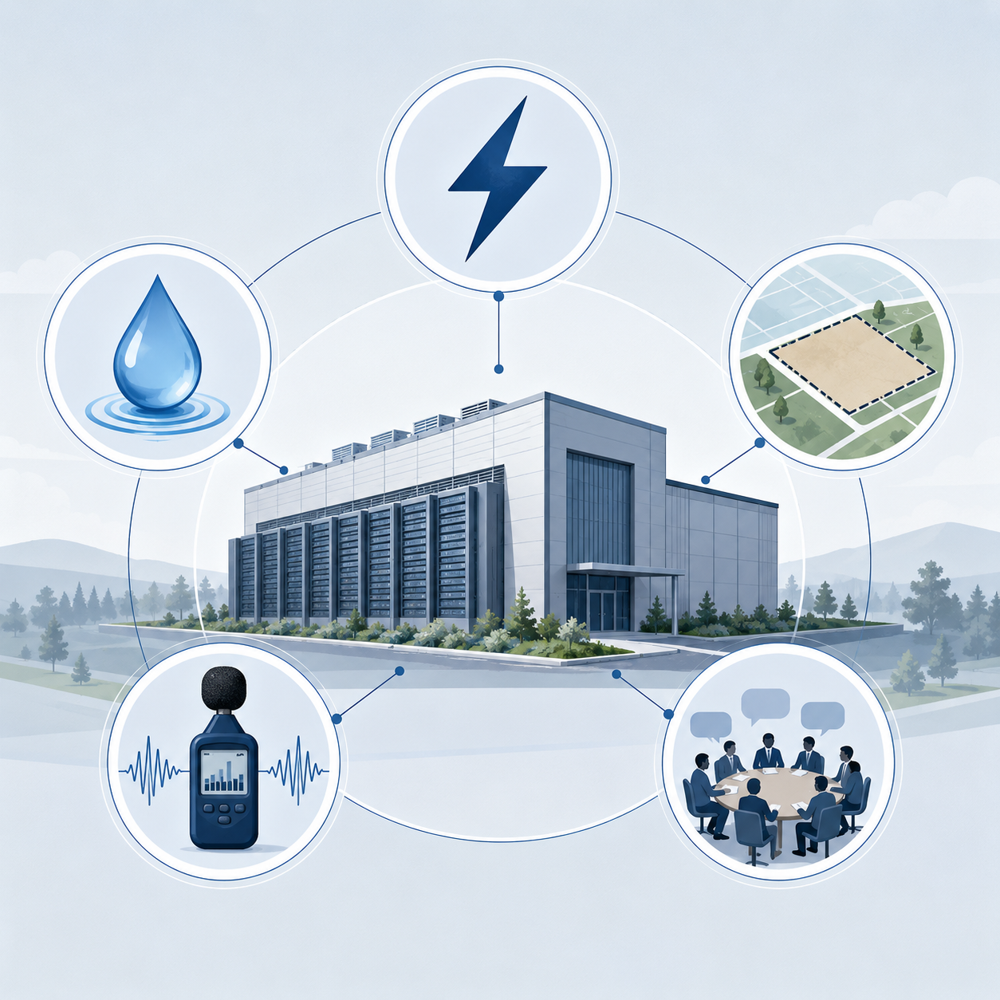

# AI 不是云上的，它正在吵醒真实社区

有些人第一次感受到 AI，不是在 ChatGPT 的对话框里。

而是在晚上睡觉时，听见一阵停不下来的嗡嗡声。

6 月 9 日，Reuters 报道了一起很有象征性的诉讼。

美国 Mississippi 的几名居民起诉了 xAI 和 SpaceX。他们说，为附近 AI 数据中心供电的设施，正在制造“无处不在、无法逃避”的噪音和震动。

这不是一个人在投诉。

这起集体诉讼估计涉及超过 1 万名成员。居民指控，这些噪音影响了他们的健康、房屋价值和生活安宁。

注意，这里被起诉的不是某个 AI 模型。

不是 Grok 回答错了问题。

不是 AI 生成了假新闻。

也不是模型有没有意识。

居民反对的是更具体的东西：噪音、震动、电厂、数据中心，以及它突然变成了自己的邻居。

过去几年，我们讨论 AI，总是问一些很大的问题。

AI 会不会取代人？

AI 会不会骗人？

AI 会不会拥有意识？

AI 会不会毁灭世界？

但现在，有些居民先问了一个更日常的问题：

**它能不能别吵我睡觉？**

这个问题听起来很小。

但它可能标志着 AI 进入了一个新阶段。

AI 不再只是屏幕里的聊天框，不再只是办公室里的生产力工具，不再只是科技公司发布会上的模型参数。

它开始变成一套能被普通人听见、看见、摸到的基础设施。

数据中心。

燃气轮机。

冷却系统。

电网。

水管。

土地。

地方审批。

税收优惠。

还有居民的夜晚。

我觉得，这才是这轮 AI 新闻真正值得写的地方。

不是“AI 很耗电”这么简单。

而是：**AI 正在把互联网重新工业化。**

过去二十年，互联网一直把自己包装得很轻。

云服务、轻资产、无边界、随时随地。

一个网页，一个 App，一个账号，好像就能连接全世界。

但 AI 把这套叙事重新拉回了地面。

你每一次提问背后，都有某个地方的服务器在运转，有 GPU 在发热，有冷却系统在工作，有电力在被消耗，有水资源和土地在被重新分配。

以前我们说 AI 在云上。

现在越来越多的人发现：

所谓云，其实落在别人后院。

## 一、所谓云，其实是一整套很重的东西

“云”这个词很成功。

成功到我们真的以为它是轻的。

文件在云端。

照片在云端。

模型在云端。

智能也在云端。

但云不是天上的云。

云是某个地方的一块地。

是一排没有窗户的厂房。

是一组变压器。

是一套冷却系统。

是一条供水管线。

是一张地方政府的审批文件。

也是某个社区居民晚上听见的低频噪音。

我们平时打开 ChatGPT、Claude、豆包、Kimi，很容易觉得 AI 是纯软件。

一个输入框。

一个回复。

几秒钟。

好像它没有重量。

但大模型越像魔法，背后的基础设施越像重工业。

AP 今年 6 月报道了一份 United Nations University 的报告。

这份报告估算，全球数据中心上一年的耗电量达到 448 TWh。

这个数字是什么概念？

它已经超过了世界上绝大多数国家的年用电量。

报告还估计，全球数据中心产生的二氧化碳排放约为 2.08 亿吨，接近阿根廷这样的国家级规模。为了发电和冷却，相关用水也达到 1.2 万亿加仑左右。

这里要说清楚：这些是全球数据中心整体的数字，不是 AI 单独消耗。

但 AI 正在快速改变这张账单的结构。

同一份报告提到，当前约 20% 的数据中心能耗与 AI 相关。到 2030 年，这个比例可能升到 40%。

也就是说，AI 不是从零开始创造了数据中心问题。

但它正在给这个问题加速。

过去的数据中心，主要服务搜索、社交、电商、视频、云计算。

现在，大模型训练和推理让数据中心变成了 AI 竞赛的核心资产。

以前大家比谁的 App 用户多。

后来比谁的数据多。

现在还要比谁有更多 GPU，谁有更便宜稳定的电，谁能更快拿到土地和审批。

这就是为什么“云”这个词有点骗我们。

它把一套很重的东西，包装成了轻飘飘的服务。

你看到的是一句回答。

某个地方看到的是一座数据中心。

你看到的是“生成中”。

某个地方听到的是机器的低频轰鸣。

## 二、AI 正在把互联网重新工业化

过去二十年，互联网最迷人的地方，是它看起来不需要太多物理世界。

一家公司可以没有工厂。

一个产品可以没有货架。

一个团队可以在咖啡馆里写代码，然后服务全球用户。

这就是所谓轻资产。

但 AI 正在让互联网重新变重。

模型越大，推理越多，算力越贵，基础设施就越重要。

模型公司正在变成基础设施公司。

这句话听起来有点抽象，但你看它们现在争什么就知道了。

争 GPU。

争电力。

争数据中心。

争冷却方案。

争地方政府支持。

争可以快速开工的土地。

谁能拿到便宜、稳定、持续的电，谁的推理成本就可能更低。

谁能更快建好数据中心，谁就能更快部署模型。

谁能让地方政府相信“这是未来产业”，谁就能拿到更快审批、更好配套，甚至税收优惠。

所以 AI 竞争不只是模型排行榜。

它也是一场基础设施竞赛。

这也是为什么数据中心突然变成政治问题。

以前大家觉得互联网公司就是软件公司。

软件公司最严重的问题，可能是隐私、算法推荐、版权、平台垄断。

但当 AI 公司开始需要电厂、水源和大片土地时，它就不再只是软件公司。

它开始像工业公司。

它会改变一个地方的用电结构。

改变一个地方的土地用途。

改变一个地方的水资源压力。

改变一个地方居民对夜晚、空气和房价的感受。

这就是“重新工业化”。

不是说互联网倒退回了钢铁厂时代。

而是数字经济终于露出了它一直依赖的物质底座。

以前这个底座被“云”这个词遮住了。

AI 把它重新放大了。

## 三、这就是“邻避”：居民不是反 AI，而是在问凭什么是我

很多人看到居民反对数据中心，第一反应可能是：

是不是又是反科技？

是不是不懂 AI？

是不是只想享受服务，不愿意承担代价？

我觉得不能这么简单。

这里有一个词，叫“邻避效应”。

英文是 NIMBY，Not In My Backyard。

意思是：我不一定反对某个设施存在，但我反对它建在我家旁边。

垃圾焚烧厂。

高压线。

化工园区。

核电站。

大型物流仓库。

这些都是典型的邻避对象。

它们都有一个共同点：

社会整体可能需要它，但具体成本往往落在某些社区。

如果收益被说成公共的，成本却压在少数人身上，冲突就会出现。

数据中心现在也进入了这个逻辑。

Reuters/Ipsos 6 月 11 日公布的一项民调显示，美国人对 AI 数据中心建设速度已经明显不安。

大约只有三分之一受访者支持当前 AI 数据中心的快速建设。

57% 的受访者反对在自己社区建设数据中心。

只有 14% 接受数据中心建在附近。

Reuters 还引用 Cleanview 的数据说，美国目前已有 710 个数据中心在运营，另有 1,062 个规划项目。

这组数字很能说明问题。

AI 数据中心不再是遥远的产业新闻。

它正在进入地方政治。

进入社区听证会。

进入居民的电费账单。

进入房屋价值和水资源争论。

居民不是突然反科技。

他们只是把“云端智能”的账单摊开了。

如果一个数据中心建成之后，科技公司拿到算力，地方政府拿到投资额和政绩，用户拿到更快的 AI 服务；但附近居民承担噪音、电价、水资源、污染和信息不透明，那他们当然会问：

凭什么是我？

这个问题不落后。

也不反智。

这是现代技术落地时最基本的政治问题。

## 四、五张账单：AI 落地后，谁在付钱

AI 数据中心的争议，不能只说“耗电”。

耗电只是其中一张账单。

真正让居民不安的，是一整套账单同时出现。

### 第一张，是噪音账单。

这也是 xAI / SpaceX 诉讼最直接的地方。

Reuters 报道中，居民指控供电设施带来持续噪音和震动。

他们说，家本来应该是一个人躲开外部世界的地方。

但如果噪音 24 小时侵入家里，生活的基本安宁就被拿走了。

这句话很有力量。

因为它把 AI 从未来叙事拉回了普通生活。

科技公司说，我们在建设下一代智能基础设施。

居民说，我晚上睡不着。

这两句话不在同一个语境里。

但它们说的是同一件事。

### 第二张，是电费账单。

AI 数据中心需要大量电力。

这不只是公司自己的成本。

当一个地方突然进入大型数据中心项目，居民自然会担心：电网够不够？电价会不会涨？公共基础设施是不是优先服务大公司？

Reuters/Ipsos 的报道里，有受访者明确提到自己已经很担心电费。

这里也要谨慎。

不能简单说“数据中心已经导致某地电价上涨”，除非有具体地方数据。

但居民的担心本身就值得写。

因为电力不是抽象资源。

它是家庭每个月看得见的账单。

当 AI 公司说“我们需要更多算力”，普通人听见的可能是：

你们需要更多电，那最后谁付钱？

### 第三张，是水账单。

数据中心要散热。

不同数据中心的冷却方式不同，有些更多依赖空气冷却，有些使用液冷系统，有些会在特定天气下用水来提高效率。

所以不能粗暴地说所有 AI 数据中心都大量耗水。

但水资源已经变成真实争议。

The Verge 6 月 3 日报道，Google 发布了新的水资源承诺，目标是在 2030 年前补充超过其数据中心消耗的水。

Axios 6 月 11 日也报道，Amazon 正在强调自己的数据中心用水效率，并推进补水目标。

大公司为什么突然开始讲水？

不是因为水以前不重要。

而是因为公众开始问了。

当数据中心建在干旱地区、农业地区或水资源紧张地区时，居民不会只看“AI 能不能提升生产力”。

他们会问：

你用的是谁的水？

你用完之后，谁来保证本地生活和生态？

这也是为什么 Utah 的 Stratos 项目会引发争议。

The Guardian 报道说，这个项目计划占地约 40,000 acres，预计需要约 9GW 电力。项目所在地区又长期面临干旱压力。

这种规模已经不是一栋楼的问题。

它接近一个地区资源配置的问题。

### 第四张，是空气和健康账单。

这部分要更谨慎。

因为很多内容还在诉讼和指控阶段。

TechCrunch 5 月报道，NAACP 起诉 xAI，指控其使用燃气轮机导致空气污染风险。

报道还提到，xAI 计划未来购买更多涡轮设备，用于 AI 基础设施。

争议点之一，是一些设备被称为“移动”设备，是否能绕开部分许可要求。

这件事的关键，不只是污染本身。

而是速度。

为了让数据中心更快上线，公司可能先用临时方案补足电力。

但临时方案一旦规模化，就可能变成事实上的长期基础设施。

居民当然会担心：

你说这是临时的。

但它到底会运行多久？

谁来监测排放？

出了问题谁负责？

### 第五张，是透明度账单。

这可能是最重要的一张。

很多邻避冲突真正激化，不只是因为设施本身，而是因为居民觉得自己被排除在决策之外。

地方政府给了多少税收优惠？

审批过程有多快？

环境影响评估有没有公开？

用水、用电、排放、噪音数据能不能持续披露？

如果项目带来收益，收益怎么分配？

如果项目带来外部性，居民怎么补偿？

这些问题比技术参数更重要。

因为普通人不一定懂 GPU，不一定懂液冷，不一定懂电网调度。

但他们懂自己的家。

懂晚上能不能睡觉。

懂电费有没有涨。

懂附近水资源紧不紧张。

懂政府是不是先和企业谈好了，再回来告诉他们“这是未来”。

AI 公司把它叫基础设施。

居民把它叫邻居。

这两个词之间，就是冲突的来源。

## 五、真正该监管的，不只是模型，还有基础设施

过去几年，我们谈 AI 监管，主要盯着几件事。

模型会不会胡说。

训练数据有没有版权问题。

用户隐私会不会泄露。

AI 会不会歧视。

高级模型会不会带来安全风险。

这些都重要。

但现在看，AI 监管还缺一块：基础设施监管。

因为 AI 不只是模型。

AI 也是数据中心。

是电力。

是水。

是土地。

是排放。

是噪音。

是地方财政激励。

是社区参与权。

如果只监管模型，不监管基础设施，就像只讨论汽车算法，不讨论道路、尾气、停车场和城市规划。

会漏掉一半现实。

一个成熟的 AI 基础设施治理，至少应该问五个问题。

第一，这个项目到底用多少电？

不是宣传稿里的“绿色”“高效”，而是具体多少电，从哪里来，会不会影响本地电网和居民电价。

第二，它用多少水？

来自哪里？

是市政供水、地下水、再生水，还是其他来源？

在干旱地区，这个问题尤其重要。

第三，排放和噪音怎么监测？

如果有自备电力设施、备用发电机或燃气轮机，排放数据是否公开？噪音是否有长期监测？居民投诉如何处理？

第四，地方政府给了多少优惠？

税收减免、土地价格、基础设施配套、电力协议，这些是否透明？

一个地方为了吸引“未来产业”付出的公共成本，公众有没有权利知道？

第五，如果居民承担了外部性，谁来补偿？

如果房价受影响，噪音长期存在，水电成本上升，社区是否有补偿机制？

这些问题听起来不如 AGI 吓人。

但它们更现实。

因为绝大多数人不会直接面对“超级智能”。

他们更可能先面对附近的一座数据中心。

一个施工项目。

一条输电线路。

一张电费账单。

一次听证会。

AI 的治理，不能只停留在模型层。

它必须落到这些地方。

## 六、下次听到“算力基建”，先问五个问题

这篇文章讲的是美国案例。

我不想强行说中国也一定会发生同样的诉讼，或者同样的社区冲突。

没有足够公开资料时，不能这么写。

但它对中文读者仍然有提醒意义。

因为我们也越来越频繁地听到这些词：

智算中心。

东数西算。

城市算力底座。

人工智能基础设施。

大模型产业集群。

这些词听起来都很宏大。

也很正确。

但下次再听到它们时，我们不应该只问：

多少 P 算力？

多少张 GPU？

多少亿投资？

多少家企业入驻？

还应该问：

它用谁的电？

用谁的水？

占谁的地？

谁参与了决策？

如果它带来噪音、污染、涨价或其他外部性，谁来补偿？

这些问题不是为了反对 AI。

恰恰相反。

如果 AI 真要成为长期基础设施，就更需要把账算完整。

不能只把收益写进发布会，把成本留给附近居民。

不能只讲“智能涌现”，不讲电厂、水管和土地。

不能只说“未来已来”，却不让住在未来旁边的人说话。

AI 可以继续向前跑。

但如果它的好处属于所有人，成本却落在少数人的后院，那它就不只是技术问题。

它是政治问题。

也是一个很普通的问题：

当 ChatGPT 需要一座电厂，谁来忍受噪音？
