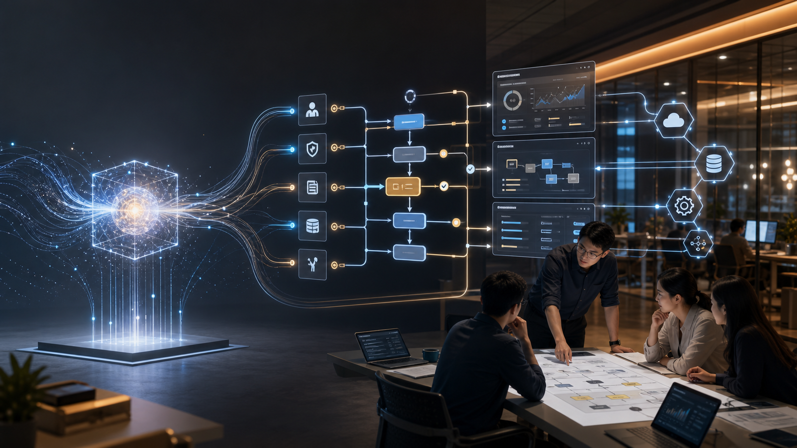
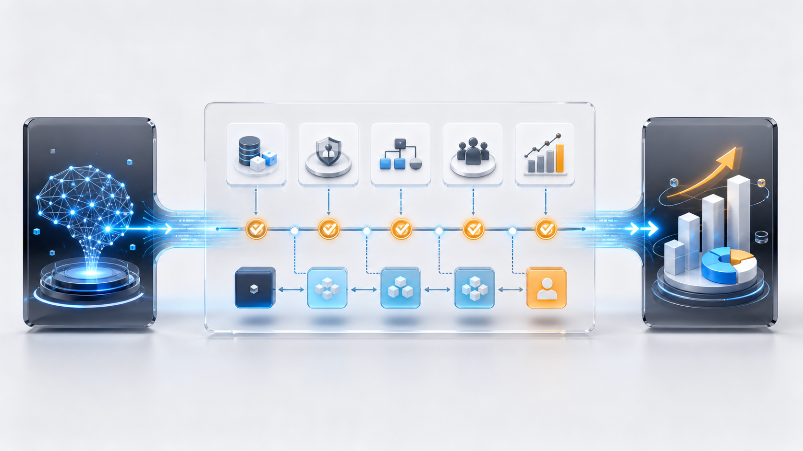
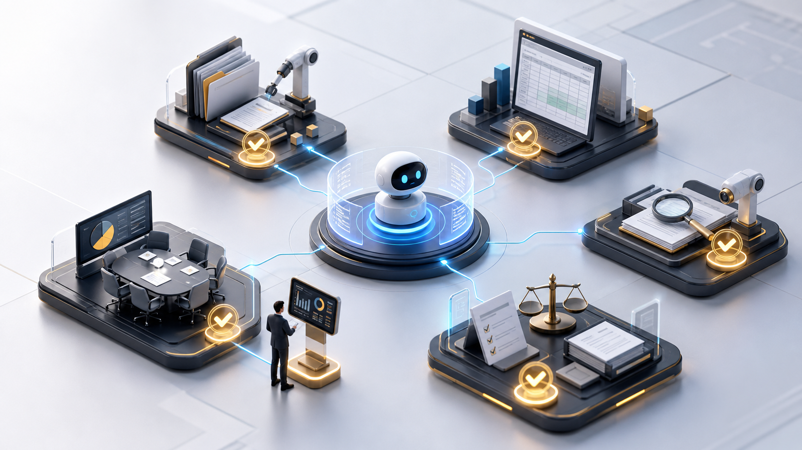

# AI 公司终于发现：客户买的不是模型

想象一个很常见的场景。

一个中型企业的老板，去年看到各种 AI 新闻，决定跟上。买了最贵的 ChatGPT 企业套餐、Claude 团队版，又开了 Microsoft Copilot。跟团队说，效率马上翻倍。

三个月后复盘，情况不太对：

数据还在十几个系统里。ERP、CRM、邮件、工单平台，格式各不一样，不知道怎么接。权限没人敢开，法务担心员工把客户数据丢进 AI。员工不知道哪一步能用 AI，索性不用。出了错也没人说得清是谁的问题。是模型的问题？人的问题？还是流程本来就有问题？

钱花了。聊天框确实能用。但业务没变快。

这不是一个真实的采访对象。这是过去两年，无数企业在 AI 落地时反复撞上的同一面墙。

然后，2026 年 5 月的第一周，发生了一件很有意思的事。OpenAI 和 Anthropic——这两家全世界最会做模型的公司——同时做出了同一个判断。它们不约而同地找上了私募股权、咨询和服务公司，开始用资本手段补同一块短板。

这块短板，叫"交付"。

---

## 企业为什么不能直接买一个 ChatGPT？

不是模型不够好。是从模型到业务之间，有一整套工作没人做。

拆开来看，企业 AI 落地卡在三类问题上：

**技术问题。** 企业数据不在一个地方。通用模型不懂你公司内部的术语、流程和规则。集成不是"接个 API"那么简单——要改系统、做中间层、建数据管道。一个在十几个系统里散落着数据的企业，光是"让 AI 看到该看的数据"，就是几个月的工程。

**组织问题。** 谁有权限用？谁审核 AI 的输出？流程要改成什么样？员工不一定愿意用——有人怕被替代，有人觉得比自己干还慢。中层管理者是最难说服的一环：他们要对结果负责，但不一定懂 AI，天然倾向"先用不犯错的方式做"。

**责任问题。** 模型说错了，是模型厂商负责还是企业自己负责？省了时间但没省成本，ROI 怎么算？金融、医疗行业还有合规、审计、监管的硬门槛。

三层问题叠在一起，就是"交付层"——不是模型不够好，而是从模型到业务之间，有一整套脏活累活没人做。

有一个案例把这件事说得很清楚。

埃森哲把 Microsoft 365 Copilot 推到了全球约 74.3 万名员工。这是目前最大规模的企业 AI 工具部署。从 2023 年开始试点。从几百人到两万人，再到二十万人，最后才覆盖全员。花了近三年。

对外披露的数据里，员工反馈确实亮眼。但更值得注意的不是"提速多少倍"，而是部署花了三年。真正耗时的不是买 license。是数据策略、权限治理、角色定制培训和变革管理。

埃森哲 CIO 说了一句很对的话：AI 投资的真正价值不在开启工具，而在投资你的员工——帮他们理解怎么用、怎么信任、怎么融入工作方式。

74 万人的公司尚且铺了三年。一家 500 人的中型企业，未必更简单——它可能没有 Accenture 那套现成的 IT 治理、培训体系和变革管理能力。

---

## 最会做模型的两家公司，同时开始补"交付"

5 月第一周，OpenAI 和 Anthropic 各自迈出了一大步。方向出奇一致。

Anthropic 和 Blackstone、Hellman & Friedman、Goldman Sachs 等合作，成立了一家面向企业 AI 服务的公司。多家媒体报道规模约 15 亿美元。模式不是卖 license，而是派 Applied AI 工程师嵌入客户公司——进机房、改系统、做实施。

OpenAI 也在做类似的事。据多家媒体报道，它正在推一个面向企业部署的合资项目，借助私募股权网络把 AI 工具推进大量企业组合公司。报道中提到了很激进的估值和回报结构，但真正值得关注的不是数字，而是 OpenAI 开始把"部署能力"当成一门独立生意。

还有一件事更能说明问题。路透社 5 月 5 日报道，OpenAI 和 Anthropic 的相关合资实体都在洽谈收购 AI 服务公司。它们要补的不是更多研究员，而是工程师、顾问和实施能力——能进客户机房、改系统、做落地的人。

两家公司同时发现了同一件事：模型强不等于客户能用。

用一句话概括这个变化：**模型公司正在发现，企业客户不是买发动机，而是买一辆能上路、能保养、出了事故知道找谁的车。**

---

## 金融 Agent 的启示：AI 会先垂直化，不会先通用化

同一周，Anthropic 发布了面向金融行业的专用 AI Agent。根据 Axios、Reuters 等媒体报道，CEO Dario Amodei 和摩根大通 CEO Jamie Dimon 同台站台。

挑几个代表任务：自动生成 pitchbook、构建财务模型、审计和估值审核、KYC 和合规调查。部分报道还提到，这些 Agent 会接入 Dun & Bradstreet、Moody's 等数据源，并和 Excel、PowerPoint 这类办公工具配合。

这类产品最有意思的地方，不是又多了几个 Agent 名字，而是它告诉我们：企业 AI 的第一批高价值场景，大概率会很窄。

为什么金融先走？

金融行业人工成本高，这是前提。建模、审计、估值这些任务规则明确，不依赖"手感"。数据密集，天然是 AI 擅长的事。更重要的是，金融行业的 ROI 文化根深蒂固——能算清楚账的产品，就有人买单。

但这组 Agent 真正说明的是另一件事：**企业 AI 不会先变成一个"通用超级员工"。它会先变成一个个垂直场景里的专用工具，从那些"数据多、规则清、人工贵"的环节切进去。**

不是一口气吃掉整个岗位。是先吃掉一个表格、一个报表、一个审核流程。

---

## 一个新的竞争维度出现了

回头看这场 AI 竞赛，竞争焦点其实在悄悄转移。

2023 年，所有人都在问：哪个模型最强？比的是 MMLU 跑分、HumanEval 排名、参数规模。

2024 到 2025 年，问题变成了：哪个产品最好用？ChatGPT、Claude、Gemini 开始卷产品体验，卷价格，卷多模态。

到了 2026 年这周，第三个问题浮出了水面：**谁能把 AI 接进我的业务，还能跑出结果？**

这不是一个技术问题。是一个交付问题。

过去两年，钱和注意力都集中在第一层——谁的模型更强。但现在，钱开始流向第三层。OpenAI 和 Anthropic 同时拉着 PE 冲进企业服务，不是巧合。它们都算明白了同一笔账：模型可以让你被看见。但能让企业签支票的，是交付。

谁先建好交付能力，谁就能在下一阶段抢到企业客户——不管它的模型是不是榜单第一。

---

## 会用 AI 还不够，要会改流程

这件事不只和企业老板有关。

只会问模型问题的人，会越来越普通。现在每个人都能跟 AI 聊天。

我现在越来越觉得，prompt 这个词被高估了。真正难的不是把一句话问漂亮，而是把一件反复发生的事拆清楚。

值钱的是能拆流程的人：知道哪一步该自动化，哪一步必须人审，哪一步不能碰。

一个简单的对比：

只会 prompt：让 AI 帮我写周报。
会改流程：把周报数据抓取、自动汇总、异常提醒、人工审核、一键发送串成一条线。

前者省了 10 分钟。后者把一个每周重复的手工流程变成了一个按钮。"会用 AI"在贬值，"能把 AI 变成流程"在升值。

未来企业里吃香的不会是"AI 爱好者"。是懂业务、懂流程、懂 AI 边界的人。这种人知道什么时候该用 AI，什么时候该关掉。

你不需要变成程序员。但需要会画一张图：你的工作从输入到输出，每一步谁在做、用什么工具、哪里能砍掉、哪里不能动。画出来，AI 能帮你的地方就一目了然。

---

## AI 的下一站，是脏活累活

回到开头那个老板。

他真正需要的不是一个更聪明的聊天框。他需要的是一整套问题的答案：数据在哪、流程怎么改、谁拍板、谁担责、怎么算账。

从 2023 年到现在，AI 行业一直在讲一个性感的故事：更聪明、更便宜、更通用。模型发布会、benchmark 榜单、融资新闻——这些东西永远有人看。

但最赚钱的部分，可能是帮一家家企业改表格、接系统、理权限、重写流程。

模型发布会负责让人兴奋，流程改造负责让公司赚钱。前者上热搜，后者进财报。

---

*信息截至：2026 年 5 月 8 日*

*本文提及的商业动作基于公开媒体报道，非官方公告确认的事实已标注"据报道""多家媒体报道"。Accenture 数据来自企业公开披露，非独立实验。*
