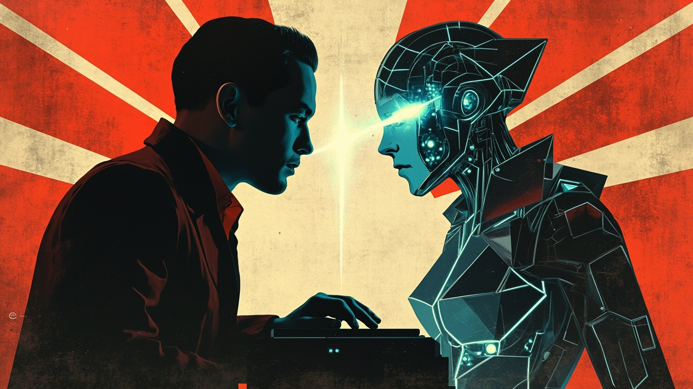
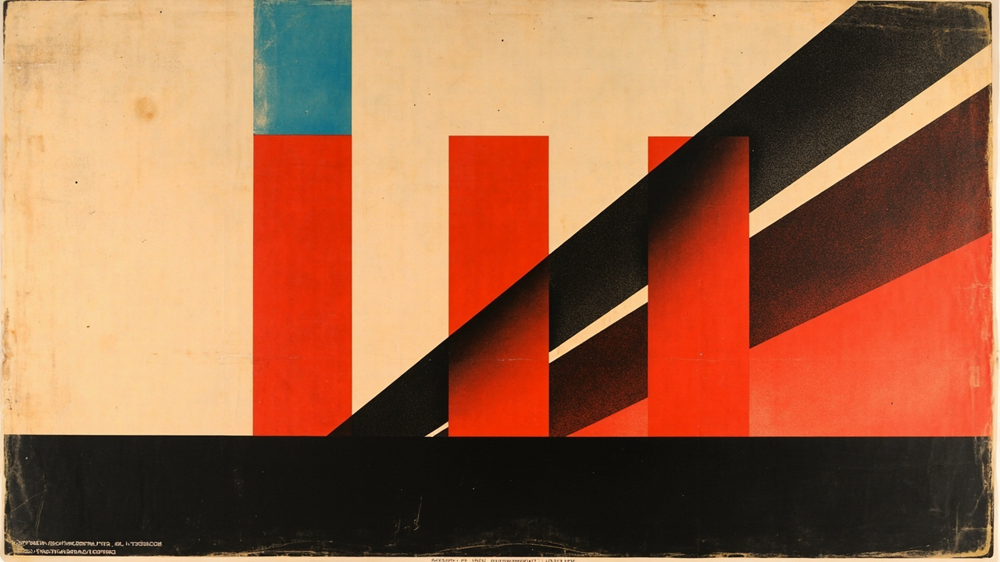

# Anthropic 2 个月反超 OpenAI：$852B 到 $965B 背后的真正引擎

> ⚠️ 草稿 / 三遍审校未跑 / 部分细节待核实
> 写作日期：2026-06-03
> 配套配图见 `images/Anthropic反超OpenAI/`（5 张 mmx 生成）

---

## 一、5/28 那天发生了什么

5 月 28 日，AI 圈有两条新闻在同一天炸开。

第一条：**Anthropic 拿到 $65B Series H 融资，估值 $965B，**反超了 OpenAI**。**

第二条：Anthropic 同一天发了一个新模型，Claude Opus 4.8。但 Business Insider 报道的时候，特地引了 Anthropic 官方的一句话——这个模型"**weaker than Mythos**"。

注意这两条新闻的顺序。不是 Anthropic 先发模型、再融钱。是同一天两件事一起。

3 个月前，Anthropic 的估值是 $380B。3 个月后是 $965B。**3 个月 2.5 倍。** 投资方包括 Altimeter、Dragoneer、Greenoaks、Sequoia、Coatue、ICONIQ——清一色美国一线基金。同月稍早，Amazon 又追加了 $25B（之前已有 $5B）。

Anthropic 一年前的年化收入是 $9B。3 个月前是 $30B。5 月是 $47B。

**一年翻近 5 倍。**

而 OpenAI 3 月刚融了 $122B，估值 $852B。被反超了。

现在回头看 5/28 那天的"自承弱"——Anthropic 官方在发布 Opus 4.8 的时候，主动说它"substantially behind"那个没发布的 Mythos。这件事**可被解读为**故意暴露自己还有一张更大的牌。

为什么要主动暴露？我后面会说。但先把第二个问题放出来——

**如果反超靠的是 Opus 4.8，那这个模型不该"自承弱"。**

---

## 二、反超的真正引擎

这里我要说一个**我的判断**——信源支持一部分，但不是 100% 板上钉钉。

反超的真正引擎**可能**不是 Opus 4.8。**可能是** Claude Code。

Claude Code 是 Anthropic 2025 年下半年推出的 agentic coding 助手。[^1] 它的核心是"你描述需求，AI 自己写代码、跑测试、改 bug、提交 PR"。人这一侧的角色变了——从"逐行写代码的人"变成"看 AI 写完代码、决定要不要收的人"。

[^1]: 具体发布日期我没查到原新闻，标 TODO。

为什么我的判断是它？

第一，**估值跳升和 ARR 跳升是同向的**。如果反超靠的是某一次模型发布，那 ARR 不会跟着跳。ARR 跳说明**有持续的收入流**——不是一波模型热度。

第二，**TechCrunch 和 LA Times 同期报道里，都把 Claude Code 列为 toB 增长主推手**。LA Times 5/28 那一篇说："Late last year, the release of its agentic coding assistant, Claude Code, propelled it ahead in the AI race." 这句话 Anthropic 自己没否认。

第三——**这是我自己的体验**。

我用 Claude Code 大概 6 个月。最早是当"自动补全"用。后来变成"让 AI 写完整函数、我 review"。再后来变成"我说需求，AI 写整个模块、我只改架构层"。

这个变化是渐进的。但我回头看，**变化最大的不是 AI 变强了，是我的工作内容变了**——我不再写代码，我在审代码。

这个过程其实和我上周写的 [《AI 会让人「异化」吗？》](归档/AI异化劳动-马原课堂分享-2026-05-30/11-final.md) 里"劳动过程异化"那一段讲的是同一件事。那篇讲的是劳动者被异化的视角；这篇讲的是——**资本为什么突然被重新定价**。

toB 开发者这个圈层，是 AI 行业里付费意愿最高、LTV 最高、最不可能"用了就走"的一群人。Claude Code 一年时间把这群人的工作流改了。Anthropic 的收入曲线，本质是这群人用脚投票的结果。

**Opus 4.8 是给资本市场看的"我们有顶级模型"。Claude Code 是给客户用的"我们真改变了你工作"。前者讲故事，后者收钱。**

---

## 三、收入曲线不会骗人

展开看一下 Anthropic 的 ARR：

- 2025 年底：$9B（LA Times 引）
- 2026 年初：$30B（Forbes 引）
- 2026-05：$47B（Forbes / OpenTools 引用 Reuters）

5 个月翻 1.5 倍。**1 年翻近 5 倍。** 这种曲线在 toB SaaS 行业几乎没见过——通常 ARR 跳升都是用户数暴增，Anthropic 是单客户价值跳升。

对比 OpenAI：

- 3 月融 $122B，估值 $852B
- 8 亿 ChatGPT 周活用户
- 但 CNN 5 月底提到："Anthropic leapfrogs OpenAI... missed revenue targets"

> ⚠️ **TODO**：OpenAI "missed revenue targets" 具体指什么、哪个季度、miss 多少——CNN 没说细节。**我刻意不展开这个数字，怕编。**

用户多不等于收入强。几亿 ChatGPT 周活 vs 几十万 Claude 企业付费（具体数字待核实，**不是这节的论点**）——ChatGPT 是流量生意，Anthropic 是合同生意。**流量生意的估值靠想象，合同生意的估值靠 ARR。**

投资人现在终于发现"用户数 = 估值"这套逻辑不成立了。Anthropic 的"少用户、高 LTV"反而被市场重新定价。

**OpenAI 错在太像一家 toC 公司。Anthropic 对在从来没假装自己是 toC。**

---

## 四、Hassabis 为什么在 I/O 上认输

5/28 同一天，Google DeepMind CEO Demis Hassabis 在 Google I/O 2026 + Axios 采访里说了两件事。

第一件：AGI 可能 2029–2030 到来，"甚至可能 2029"。

第二件：他**主动提到**了 Anthropic 的 Mythos——"**The fact that Anthropic's Mythos has the power to catch businesses and governments off guard shows that we are not yet prepared for the rapid evolution of these systems.**"

**注意主语。**

这句话是 Google DeepMind CEO 说的。在自家年度大会上。对象是一屋子的 Google 合作伙伴和投资人。内容是"我们的竞争对手有一个模型，能让企业和政府措手不及，我们还没准备好"。

这非常反常。CEO 在自家大会不吹自家 Gemini，反而举对手的例子。**我猜**这背后是三层意思里的某一层——

- **给监管听**：AGI 警告是真警告，呼吁政府介入
- **给 Google 内部解压**：我们落后不是 Gemini 团队不努力，是对手太超规格
- **给投资人听**：6/1 Alphabet 宣布计划融 $80B 用于 AI 基建。**融这么多还落后？** Hassabis 的"我们没准备好"，是给融钱找合理性。

不管哪一种，**他都公开承认了一件事：Anthropic 在某些维度上领先了 Google**。

> ⚠️ **TODO**：Mythos 到底是什么？媒体报道模糊。TechCrunch 早前说它"和关键基础设施相关、已用于 15+ 国家"，但 5/28 这一波报道里没有详细技术描述。**找不到原文我就不展开 Mythos 的功能。**

LA Times 同期还有一篇文章标题是「Google's internal struggle is handing the AI coding race to Anthropic and OpenAI」。**我只引标题，不下内部故事的判断**——单标题做不了因果推断。

---

## 五、IPO 三连发

Anthropic 不是唯一一个在 5 月底 6 月初有大动作的 AI 公司。

- 5/26 SpaceX（已经合并 xAI）公开递交 IPO，估值 $1.75T–$1.8T，融 $75B+
- 6/1 Anthropic 秘密递交 S-1
- 据 Bloomberg 报道，OpenAI 会在"未来几天或几周"递交

**三家最有价值的 AI 公司，同一个时间窗口上市。**

Wedbush Securities 分析师原话："**This represents an opening of the floodgates for the IPO market, which has been relatively dormant for a few years.**"

为什么是现在？我看主流解释是"AI 泡沫论压顶，需要公开市场的资金接盘"。**但我有个更简单的判断**——

**Anthropic 选在估值 $965B 上市，而不是再等一年融 Series I，是主动选择顶点套现。**

同样，OpenAI 选在 ChatGPT 8 亿用户、估值 $852B 上市，是抢公开市场流动性。SpaceX 选在合并 xAI 第一年上市，是让 Musk 的个人版图从私募估值切换成公开估值。

**三连发不是泡沫破裂。是"知道顶点在这里，先把钱拿走"。**

但这里有另一条更值得跟踪的副线——

5 月，OpenAI 投了 **$4B 启动 Forward Deployed Engineers（FDE）项目**——把工程师塞进客户公司做"驻场"。客户付的不是 API 调用费，是工程服务费。

**FDE 是什么？** 是 Palantir 用了 20 年的模式。Palantir 不卖软件产品，卖"派工程师帮你落地"。客户付的是人天费，不是订阅费。

OpenAI 推 FDE，等于**从"卖 API"转向"卖服务"**。

这条线跟 Anthropic 走的是相反方向。Anthropic 坚持卖订阅、卖 API、让 toB 客户自己集成。OpenAI 推 FDE 是说"客户自己搞不定，我们派人帮你搞"。

**两家 AI 头部公司，同一行业，走出两条完全不同的商业路径。** 一家像 SaaS 公司，一家像咨询公司。

这才是真正值得跟踪的信号——不是估值反超，是**商业模式的分化**。

---

## 六、剩下的问题

写到这里，有 4 个问题我答不上来。

1. **Mythos 到底是什么？** 媒体报道只说"能让企业和政府措手不及"——但具体是什么能力、为什么"措手不及"、技术上跟 Opus 4.8 差距在哪？**我没找到公开技术报告。**

2. **OpenAI "missed revenue targets" 具体指什么？** CNN 一句话带过——是 ARR 没到预期？是企业合同缩水？是推理成本失控？**不知道。**

3. **FDE 模式是不是 AI 公司向 Palantir 模式靠拢？** 4B 美元启动金不便宜，OpenAI 是不是在变成"AI 行业的埃森哲"？**这个问题要等 FDE 跑一年再判断。**

4. **最关键的——**

> **当所有顶级 AI 公司都开始做"agent"、做"FDE"、做"垂直整合"——他们到底是在卖软件，还是在卖服务？**

如果这个边界模糊了，传统的"软件公司"估值模型可能要重写。Anthropic $965B 估值的"合理性"，可能不在于"它会变成下一个微软"，而在于"它会不会变成下一个 Accenture + OpenAI 的混合体"。

**这两个问题的答案，决定了 2026 下半年 AI 公司的股价走向。**

---

*写作时间 2026-06-03，配图 5 张（同苏联构成主义 + 青色发光签名风格，与 5/30 AI 异化劳动系列同款）。*

*待核实：*
- *Mythos 公开技术报告*
- *OpenAI "missed revenue targets" 具体细节*
- *Claude Code 准确发布日期*
- *ChatGPT 8 亿周活 / Claude 50 万企业付费 最新数字*
