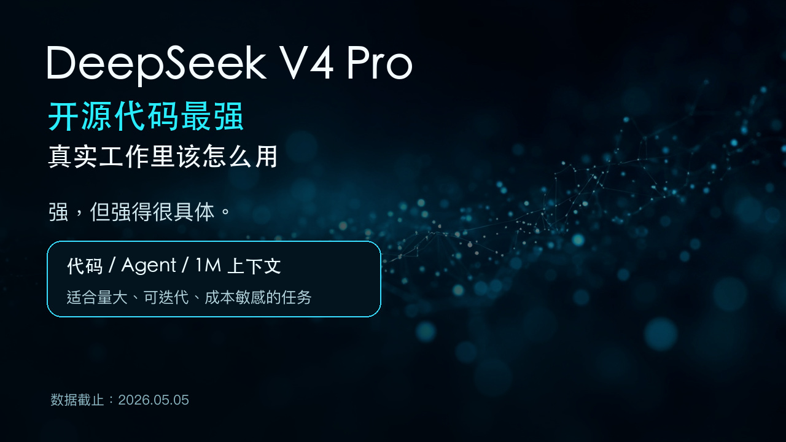
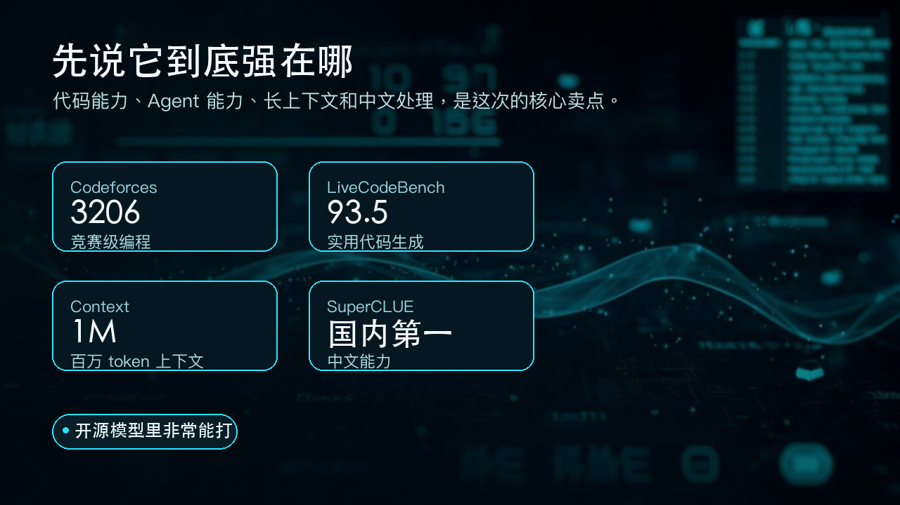
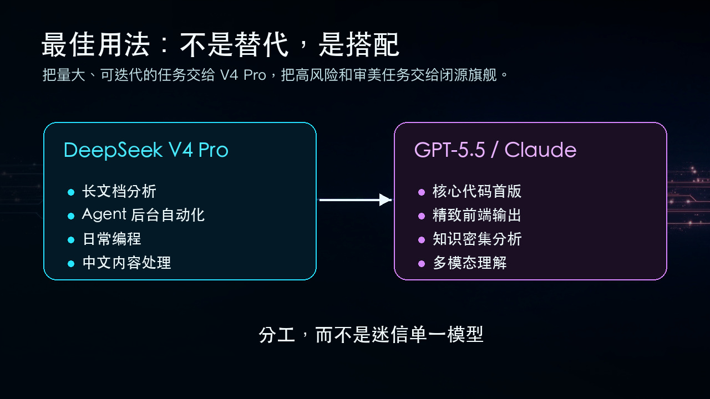
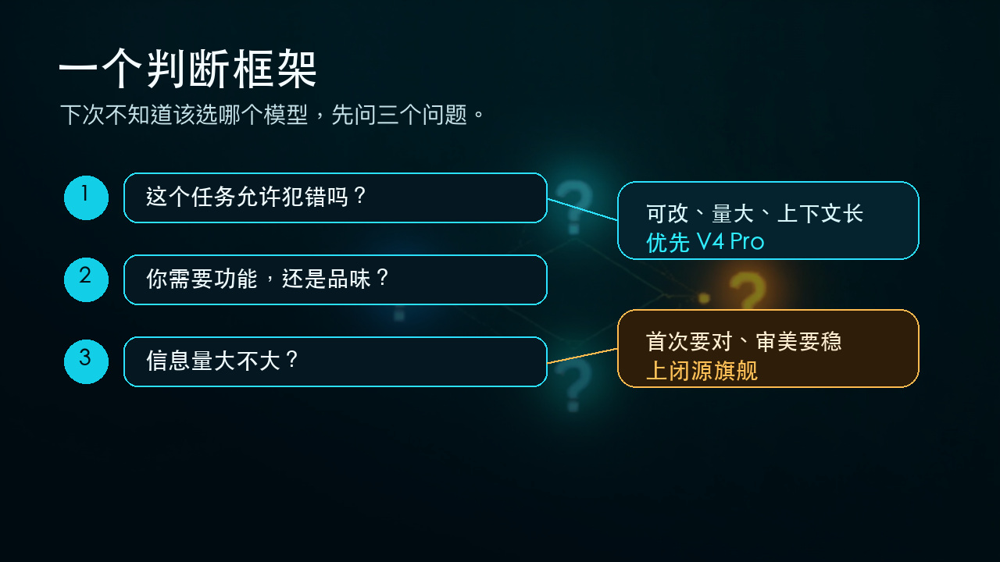

# DeepSeek V4 Pro：开源代码最强，真实工作里该怎么用

DeepSeek V4 Pro 发布一周了。

两个跑分让我印象深刻：LiveCodeBench 93.5，Codeforces 3206，两项在公开榜单里都是第一名。注意，是所有模型，不分开源闭源。

但另一个数字更值得琢磨：输出价格 $3.48/百万 token。Claude Opus 4.6 是 $25/百万 token——便宜了 86%，差不多是后者的 1/7。

听起来像是一个"便宜又强"的完美故事。但翻了几乎所有主流评测、独立测评机构和社区的真实反馈之后，我的判断是：**它很强，但强得很具体。不适合所有人的所有任务。**

---

## 先说它到底强在哪

代码能力是真强，不是"开源最强所以强"那种相对论——在代码和 Agent 的几个关键基准上，确实压过了 GPT-5.4 和 Claude 的部分版本。

**竞赛级编程**：Codeforces 3206 分，超过了 GPT-5.4 的 3168。这个分数意味着它在算法竞赛里能达到人类顶级选手水平。

**实用代码生成**：LiveCodeBench Pass@1 93.5，排名第一。SWE-bench Verified 按官方/公开榜单口径是 80.6%，接近闭源旗舰；但 CAISI（NIST 下属机构）独立复测只有 74%，差距拉到 7 个百分点——看官方跑分时心里要有这根弦。

更关键的是 Agent 能力。MCPatlas 评测里，V4 Pro 拿了 73.6 分，和 Claude Opus 4.6 的 73.8 几乎持平。Vals AI 的 Vibe Code 基准里，它在开源模型中断层第一，甩开第二名 Kimi K2.6 十几个百分点。

翻译成人话：**把它接到 Claude Code 或你的自动化工作流里，它能干活。而且干得不错。**

还有两个容易被忽略的优势。

一个是 100 万 token 上下文，标配，不加钱。整本《三体》三部曲一次塞进去。对比很多模型默认的 128K/200K 上下文窗口，1M 是这次最醒目的卖点之一。

另一个是中文能力。SuperCLUE 最新测评，V4 Pro 拿了 70.98 分，国内第一。如果你主要写中文内容、处理中文文档，这个优势会更容易体现出来。

有知乎用户称高强度用了一天 V4 Pro，推理强度开到 Max，烧了约 1 亿 token，花了 16 块（应为缓存命中后的价格，未独立复现）。他的评价是：**1M 上下文是最大亮点，不需要反复压缩上下文，Agent 挂在后台持续稳定运行。**

---

## 但这些地方，它还不够

跑分是一回事，真实任务里又是另一回事。

**复杂工程从零搭建**。有评测用了一个终极压力测试：让 AI 从零写一个宝可梦战斗引擎——完整的游戏逻辑、UI、对战系统。V4 Pro 交出来的是静态页面加逻辑错误，游戏跑不起来。GPT-5.5 做出来了。

**前端精雕细琢**。需要审美判断的任务——精致的 UI、漂亮的排版、有风格的视觉输出——Claude 和 GPT-5.5 仍然更稳。V4 Pro 能做功能，做不出品味。

**知识类任务明显短板**。SimpleQA 事实准确性测试，V4 Pro 拿了 57.9，Gemini 3.1 Pro 是 75.6。在你不熟悉的领域，它给出的"事实"需要多留个心眼。

**幻觉率偏高**。Artificial Analysis 的评测显示：V4 Pro 在不知道答案时，有 94% 的概率会编一个答案出来。这个数字比官方自评严重得多。

**还有两个硬伤**：不支持多模态（2026 年了一个万亿参数模型不能识图），没有小型蒸馏版（你想在本地跑？即使 Flash 版 284B 参数，32GB 内存的机器也跑不动）。

SuperCLUE 测评里它的中文写作"立意深远、结构严谨"，用词比 GPT 简洁，不啰嗦。但一到需要精确事实的任务——比如问你一个冷门 API 的参数含义——它更倾向于"自信地编一个"，而不是说"我不确定"。

官方自己的评价算诚实：**整体能力落后顶级闭源模型约 3 到 6 个月。**不过 CAISI（NIST 下属机构）的独立评估更保守，认为真实差距接近 8 个月。

---

## 最佳用法：不是替代，是搭配

看了一圈社区讨论，最聪明的用法不是"选 V4 Pro 还是选 GPT-5.5"，而是两个都用。

真实工作流里可以这样分工：

**交给 DeepSeek V4 Pro 的任务**：
- 长文档分析（法律合同、财报、论文、代码库）
- Agent 自动化（后台挂机跑不心疼，上下文不够用也不焦虑）
- 日常编程（大部分场景 Flash 版就够，更便宜）
- 中文内容处理（翻译、摘要、文案）
- 成本敏感型批量任务

**交给 GPT-5.5 / Claude Opus 的任务**：
- 生产级项目核心代码（首次就必须正确）
- 需要精致前端输出的场景
- 知识密集型分析（当你没法立刻验证答案的时候）
- 需要多模态理解的任务
- 高风险决策的信息支撑

一句话总结这个分工逻辑：**量大、便宜、允许试错的，给 V4 Pro。第一次就要对的、审美要过关的、知识要准确的，给闭源旗舰。**

这样搭配，整体成本能降一大截。在大量日常任务切到 Flash/Pro 的情况下，成本有机会降到原来的十分之一量级。具体省多少取决于你的任务配比，但方向是清楚的：靠分工而不是靠单一模型，比死磕旗舰划算得多。

---

## 一个判断框架

下次你面对一个新任务，不确定该用哪个模型的时候，问自己三个问题：

1. **这个任务允许犯错吗？** 如果可以改、可以迭代，V4 Pro 是首选。如果第一次就要对，上闭源旗舰。

2. **你需要的是功能还是品味？** 功能正确，V4 Pro 能做到。审美在线、风格对味，Claude 更懂。

3. **信息量大不大？** 长文档、大代码库，V4 Pro 的百万上下文是天然优势。短平快的知识查询，GPT 的准确性更好。

---

DeepSeek V4 Pro 重新定义的不是 AI 能力的上限，而是 AI 能力的成本边界。

以约 1/7 的价格，做到顶级模型约 87% 的综合能力（按 Artificial Analysis Intelligence Index 粗略换算）。代码和 Agent 甚至在某些指标上反超了——这在一年前不可想象。它还开源了，MIT 协议，你可以拿去商用、自部署、做微调。

也是少数敢在官方公告里写"我们还有差距"的团队。这种诚实，在这个行业里比跑分更稀缺。

但别因为它便宜就把它当成万能工具。用对的场景，省一大笔钱。用错的场景，填坑的时间比省的钱多。

好工具的价值体现在真实任务里，不在跑分榜单上。

---

*发布时间：2026年4月24日 | 当前版本：预览版 | 测试基准来源：Artificial Analysis、CAISI/NIST、SuperCLUE、Vals AI*

*数据截止：2026年5月5日*
