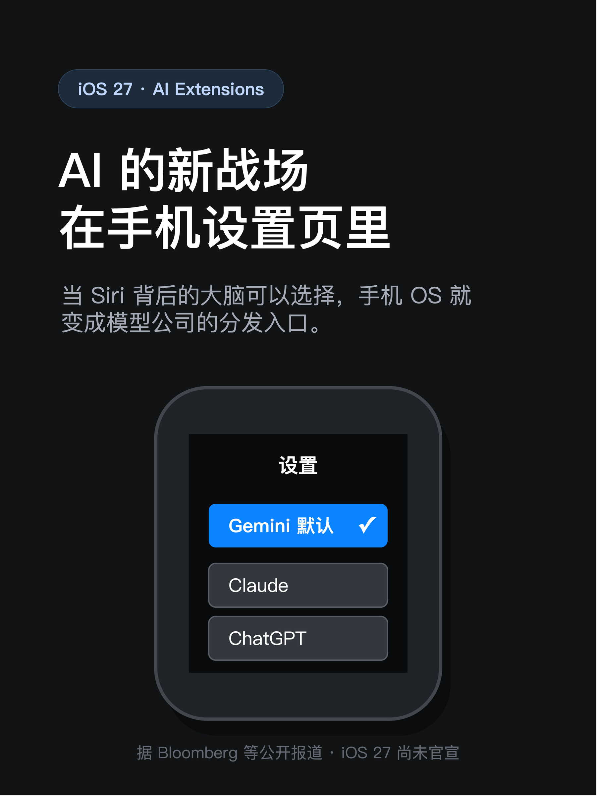
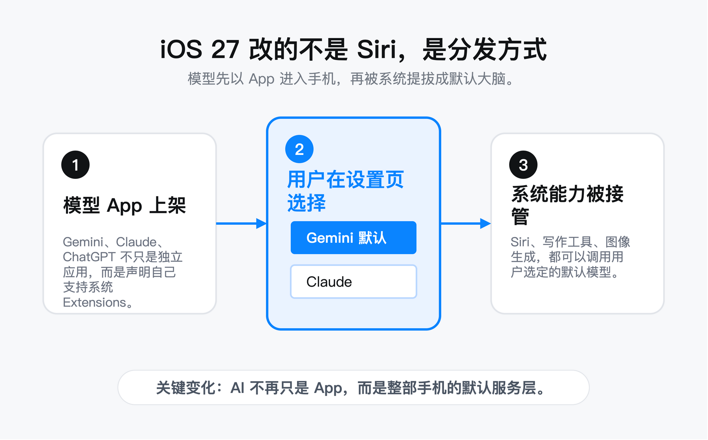
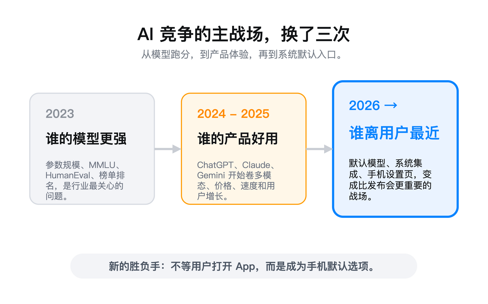
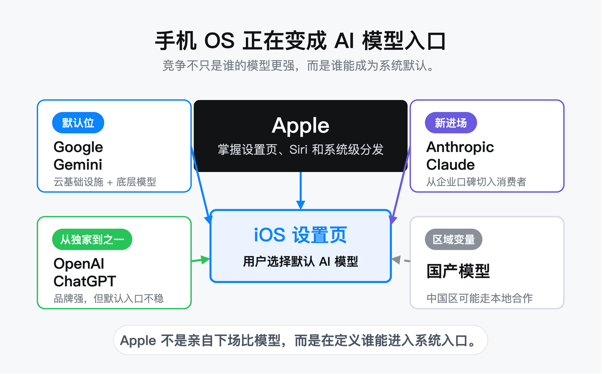

# AI 的新战场，不在 App 里，在手机设置页里

以后你买 iPhone，选的可能不只是颜色、内存、摄像头。

还得选手机的大脑：Gemini、Claude、ChatGPT，还是以后某个国产模型。

2026 年 5 月 5 日，Bloomberg 的 Mark Gurman 发了一篇报道。根据多位知情人士的说法，iOS 27 会加入一个叫"Extensions"的功能。用户在设置里选一个第三方 AI 模型，然后它就会驱动 Siri、写作工具、图像生成——系统级集成，不是下载一个 App 那么简单。

这件事还没官宣。WWDC 6 月 8 号才开，正式发布要等秋天。

但方向已经很清楚了：手机操作系统，正在变成 AI 模型的分发入口。

这比任何一个模型的 benchmark 分数都重要。

---

## iOS 27 到底要改什么

先把传闻说清楚。

iOS 18 的时候，Apple 把 ChatGPT 接了进来。Siri 答不上来的问题，转给 ChatGPT。写作工具、Image Playground 也能用。但这是 Apple 替你选的——只有一个选项。

iOS 27 要改的就这一点。

根据 Bloomberg 的报道，新系统会让用户在设置里自选 AI 模型。模型厂商不需要和 Apple 签独家——他们只需要在 App Store 上架自己的 App，然后在 App 里声明自己支持 Extensions。用户安装了，就能在系统设置里切换。

还有一个细节值得注意：不同 AI 模型可以对应不同的 Siri 声音。Apple 自己的模型用小 A，Claude 用小 B，Gemini 用小 C。你一耳朵就能听出来现在是谁在回答。

这个设计看着小，背后意图很大。Apple 在告诉你：这不是一个模型取代另一个模型。是每个模型有自己的个性和长项，你按需选。

目前据传在测试中的，至少有两家：Google Gemini 和 Anthropic Claude。ChatGPT 应该也会保留——毕竟它是现在唯一的选项。

---

## 默认模型，比最强模型更重要

这件事的核心，不是哪个模型最强，而是哪个模型是"默认"。

你一拿到新 iPhone，开机，激活，没动过任何设置。这时候 Siri 背后驱动的是谁？那个模型，就是吃到入口红利的最大赢家。

根据目前的报道，这个默认位是 Google Gemini。

Google Cloud CEO Thomas Kurian 在 4 月的 Cloud Next 大会上已经说过一遍了。他说了两件事。第一，Google 是 Apple 的"首选云提供商"。第二，两家在合作开发下一代 Apple Foundation Models，基于 Gemini 技术，驱动未来的 Apple Intelligence 和"更个性化的 Siri"。

用大白话说就是：iOS 27 的 Siri，底层是 Gemini。

Google 赢得这个位置，不一定是因为 Gemini 在每一项跑分上都碾压 Claude 或 ChatGPT。而是因为 Google 能提供的是一整套——云基础设施、模型能力、和 Apple 没有直接竞争关系（至少目前没有）。

默认位的价值有多大？看一个数字：全球活跃 iPhone 超过 10 亿部。即便只有一半的人升级到 iOS 27，那也是好几亿设备。绝大部分用户不会去改默认设置。谁拿到默认位，谁就拿到了这好几亿人的第一次 AI 交互。

模型参数是给开发者看的。默认入口是给所有人用的。

---

## Anthropic 进场：Claude 要从企业走向普通人

Claude 是 Anthropic 的模型。在国内，知道它的人还不算多。但在 AI 圈里，它已经是第一梯队了。

5 月第一周，Anthropic 做了一件很对的事——和 Blackstone 等机构合作，成立企业 AI 服务公司，派工程师进客户机房做交付。我在上一篇文章里详细写过这件事。

但就在同一天，另一个消息显得 Anthropic 的野心更大：它在 iOS 27 的测试名单里。

如果你看过 Anthropic 过去两年的路线，你会发现它一直在走"企业优先"的路子。金融 Agent、合规工具、交付服务——全是 B 端打法。

iOS 27 的 Extensions 给了它一条完全不同的路：直达普通消费者。

你不需要知道 Claude 是什么公司。你只需要在设置里看到它，点一下，然后 Siri 就变聪明了。如果你的同事用 Gemini 写邮件总写得太推销腔，你可以切到 Claude，让它写得更克制一点。一人一个偏好。

对于 Anthropic 来说，这是第一次有机会让普通用户用上它的产品——不需要注册、不需要下载新 App、不需要学习。只要在设置里点一下。

从企业到消费者，这一步如果走通了，Anthropic 的用户基数会瞬间跳一个数量级。

---

## OpenAI 的尴尬：从唯一到之一

这件事里，最难受的可能是 OpenAI。

2024 年，ChatGPT 是 iOS 上唯一集成的第三方 AI。看起来像是 Apple 的"指定合作伙伴"。两年后，它变成了设置页里的一个选项——默认位还不是它。

Gizmodo 的标题写得很直白："如果你计划秋天买 iPhone，别太依赖 ChatGPT。"文章说，OpenAI 是"最大的输家"。

我没有那么确定。

ChatGPT 的名气依然是所有 AI 模型里最大的。对很多普通用户来说，AI = ChatGPT。这个优势到选择时仍然有效——在设置里看到一个熟悉的名字，比看一个没听说过的，更容易点下去。

但 OpenAI 的问题是，它和 Apple 的关系已经变了。

2024 年的合作更像是一个过渡方案。Apple 自己没模型，先借 ChatGPT 顶上。现在 Apple 选了 Google 做底层模型。Gemini 可以带云基础设施进来。而且 Google 不像 OpenAI 那样，自己也在做消费者产品和 Apple 抢注意力。

更微妙的是，OpenAI 自己也在做硬件。Ming-Chi Kuo 5 月 5 日爆料，OpenAI 正和 Qualcomm、MediaTek 合作开发 AI 手机，以 AI Agent 为核心，预计 2027 年发布。

如果你是 Apple，你会把自己的系统入口交给一个正在造手机来和你竞争的公司吗？

OpenAI 的处境很微妙。iOS 入口可能不会完全丢掉，但它不再是那个唯一的、被 Apple 首选的名字了。自研手机如果能成，当然是一条更大的路。但在那之前，它得接受自己在 iOS 上从主角变成了配角。

---

## Apple 的算盘：不做最强模型，但要掌握分发权

有人会说：Apple 自己不做出好模型，把位置让给别人，是不是认输了？

我倒觉得，这是典型的 Apple 打法。

Apple Intelligence 喊了两年，Siri 该笨还是笨。2024 年 WWDC 发布的新 Siri 功能，到现在还没落地。用户等烦了，媒体也等烦了。

然后 Apple 做了一件很 Apple 的事：自己不做最好的模型，但让最好的模型都在我这儿跑。而且，选择权给你——你决定谁是你的"AI 大脑"。

这招有三个好处。

第一，把模型竞争的压力转移出去。Siri 好不好用，不再只看 Apple 自己的 AI 团队。Google 做得好，Siri 就好；Claude 做得好，Siri 就好。Apple 从"自己做得好"变成了"谁好我用谁"。压力在模型公司那边。

第二，把分发权牢牢握在自己手里。不管用户选谁，都是通过 iOS 设置、通过 Siri。用户用的是 Apple 的产品，模型只是里面的一个零件。谁当零件可以换，但手机是我的。

第三，给监管留了一个漂亮的姿态。"我们没有垄断 AI。你看，用户可以自由选择。"——这种话面对反垄断调查时特别好用。

所以这不是认输。这是从"我做一个最强模型"变成"我做 AI 模型的 App Store"。

前者比技术。后者比生态控制力。Apple 从来更擅长后者。

---

## 国产模型为什么暂时缺席

目前所有的报道里，iOS 27 Extensions 的测试名单上只有 Google 和 Anthropic。

没有中国公司的名字。

这不意外。地缘政治和技术脱钩，正在把全球 AI 切成两块。Apple 在中国的 AI 合作大概率走完全不同的路——百度的文心一言、阿里的通义千问，或者其他国产模型。

但问题是，iOS 的设置页里能不能放一个中国 AI 模型？

技术上肯定能。政策上很复杂。Apple 得同时满足两边的监管要求。美方的数据安全顾虑和中方的数据本地化要求，在 AI 模型接口这件事上直接碰撞。

苹果过去几年在中国市场处理这类问题，两条腿走路。本地数据存本地——iCloud 中国区放在云上贵州。本地 AI 找本地伙伴——比如传闻中的百度文心一言合作。iOS 27 大概率也逃不开这个逻辑。

但问题是：如果中国用户的 iOS 设置里只能放一个国产模型，其他全球模型看不到，那中国 iPhone 用户享受的"模型自由"就比别人少。

反过来也一样。国产模型也很难通过 iOS 走向全球市场。至少在目前的规则下。

入口是开放的，但墙还在。这次不是防火墙，是生态墙。

---

## 一个新的判断：AI 竞争，进了第三个阶段

前几天的文章里，我把 AI 竞争分成了两个阶段。

2023 年，所有人都在问：哪个模型最强？比 MMLU、比 HumanEval、比参数规模。

2024-2025 年，问题变成了：哪个产品最好用？ChatGPT、Claude、Gemini 开始卷体验、卷价格、卷多模态。

现在，第三个阶段浮出了水面：**你的模型能不能成为用户手机里的默认选项？**

这不是一个技术问题。这是一个分发问题。

过去两年，钱和注意力都集中在"做最强的模型"上。但现在，一个新的竞争维度在打开：谁控制了用户第一次接触到 AI 的地方，谁就控制了接下来的一切。

手机设置页，就是那个地方。

比 benchmark 更重要的，是默认选项。比发布会更重要的，是系统集成。比模型参数更重要的，是分发入口。

Google 用云基础设施换了默认位。Anthropic 用企业口碑敲门。OpenAI 从独家变成之一，开始自己造手机来保入口。Apple 坐在中间，看着三家模型公司在自己画好的棋盘里抢位置。

这就是 2026 年 AI 行业最值得关注的战场。不在发布会。不在论文。在设置页里。

---

*信息截至：2026 年 5 月 9 日*

*本文关于 iOS 27 的功能描述均基于 Bloomberg、9to5Mac、TechCrunch 等媒体的公开报道。iOS 27 尚未正式发布，具体功能以 WWDC 2026（6 月 8 日）官方公告为准。Google Gemini 与 Apple 的合作信息来自 Google Cloud Next '26 官方公开陈述。OpenAI AI 手机信息来自 Ming-Chi Kuo 公开研报。*
