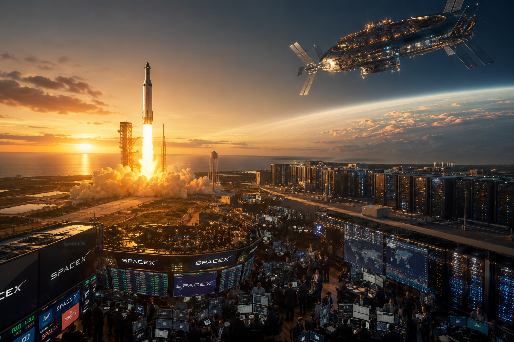
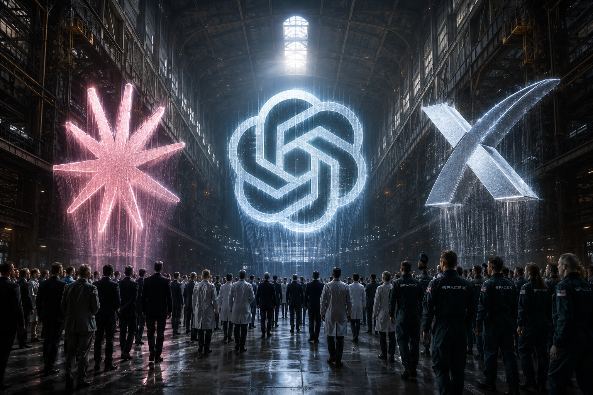
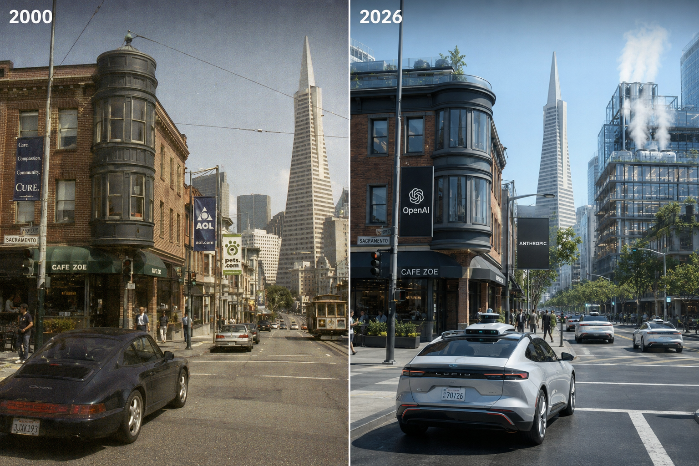
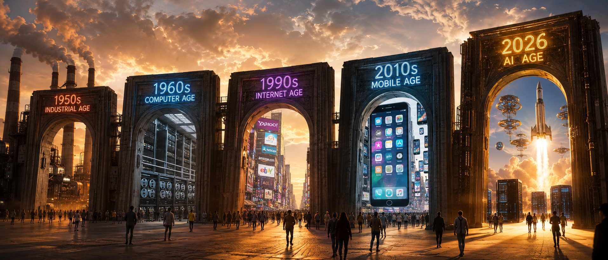

# 三家万亿 IPO 同时来——AI 资本泡沫的结局不会是崩盘

---

## 【引入】

2026 年 6 月 1 号，周一上午。

我正在看 Anthropic 申请 IPO 的新闻。这家公司 5 月 26 号刚融完一轮，估值 610 亿美元。5 周后到 9650 亿——这是给 IPO 的定价，不是给二级市场的。

然后我看到 SpaceX 4 月份已经递了表，估值 1.75 万亿。OpenAI 还在排队，市场预期 1 万亿。

3 家万亿 IPO 同期落地。人类历史第二次出现这个密度。上一次是 1950 年代——AT&T、通用汽车、埃克森美孚那一波。

"AI 泡沫要破"这个论调，从 2023 年起已经讲了 3 年。每次都被打脸。这次到底会不会真破？

我的判断是不会。但理由不是"AI 不会崩"这种空话——是底层结构变了。

---

## 一、3 家 IPO 的真实数据

**Anthropic**（2026-06-01 申请保密 IPO）：

- 估值 9650 亿美元
- 年化营收：2025 年底 90 亿美元 → 2026 年 5 月 470 亿美元
- 5 个月翻 5.2 倍。对应年化增长 150%+
- 核心驱动是 Claude Code——agentic coding 工具 2025 年底发布后爆发

**OpenAI**（排队）：

- 估值市场预期 1 万亿
- 6 月 7 日 FT 报道，OpenAI 准备推"super app"——把 ChatGPT 改造成"个人 agent"
- 砍掉 Sora 等 side quests
- 战略从散兵游勇转向集中

**SpaceX**（2026-04 申请，6 月内上市）：

- 估值 1.75 万亿（Reuters）
- 主营 Starlink + Starship + 政府发射合同
- 跟 AI 看起来无关——但 OpenAI + Oracle + 软银的 Stargate 项目已经在用 Starship 部署 AI 数据中心轨道节点

三件事同一周发生，不是巧合。是 AI 资本链进入兑现时刻的标志。

我盯着屏幕看这个数据，脑子里突然冒出一个念头——**为什么 SpaceX 也在这个时间点 IPO**？它跟 AI 看起来一点关系都没有。读完 Stargate 的资料我才反应过来：火箭不只是送人上太空，还要送 AI 数据中心上轨道。这两件事不是分开看，是同一件事的两面。

---

## 二、为什么这不是 dot-com 2.0——4 个关键区别

把 2026 年的 AI 公司跟 2000 年互联网泡沫比，是过去三年所有"看空"文章的默认剧本。

但这次至少有 4 个关键区别。

**第一，收入模式不同。**

2000 年的 dot-com 公司主要靠广告加眼球。CPM 时代没人愿意为网页付费——除了 AOL 月费 4.95 美元。

2026 年的 AI 公司真收钱。Anthropic ARR 470 亿、Apple AI 服务单季 310 亿、Snowflake、CrowdStrike 都是 SaaS 订阅。

**第二，盈利公司多。**

2000 年整个 dot-com 行业全部亏钱。Amazon 2000 年亏 8.6 亿，亏到要破产重组。Pets.com 烧钱烧到关门。

2026 年头部 AI 公司真盈利。Mistral ARR 4 亿、Anthropic 5 个月涨 5 倍、Apple AI 服务 310 亿单季。都是真金白银，不是 PPT 数字。

**第三，用户付费意愿高。**

2000 年没人愿意为网页付费。2026 年企业 SaaS 单 seat 200 美元/月起，开发者一年付 Cursor 200 美元。我自己订阅了 Claude Pro（每月 20 美元），还买了 Cursor 年付（180 美元）。**这是我愿意为工具付的钱**——2000 年没人会为网页付 20 美元/月。

**第四，真实替代效应。**

2000 年 dot-com 没有替代任何传统工作——它只是给传统行业加了一层"网页版"。报纸变新闻门户，实体店变网店，但做的事还是一样。

2026 年 AI 在真实替代软件工程师、客服、内容创作者、初级律师助理。我自己这周写文章、读论文、跑代码，三件事都有 AI 在干。我朋友在字节做客服，现在他工位上 60% 的工单是 AI 先接，AI 搞不定的才转人工。**这是真替代**，不是"网页版"那种皮毛。

> 把 2026 AI 公司跟 2000 dot-com 相比，就像把 1995 Amazon 跟 1985 Sears 相比——表面都是"零售"，底层是不同的物种。

质疑 AI 泡沫的人还在讲 2000 年的故事。但这次讲故事的公司**自己在赚钱**。这是关键区别。

---

## 三、20x P/S 不贵——估值合理性

- Anthropic 470 亿 ARR / 9650 亿估值 = 20x P/S
- 历史对照：Snowflake 2020 年 IPO 时 100x、Datadog 60x、CrowdStrike 50x
- 当前 20x 在 SaaS 历史中位数偏下

更关键的是增速。Anthropic 5 个月 5.2 倍，对应年化 150%+。dot-com 时代没有一家公司年化超过 100%。

> 2000 年思科市值 5000 亿，年化营收约 200 亿，P/S 25x，但**增速不到 30%**。2026 年 Anthropic P/S 20x，**增速 150%**。同样倍数，故事完全不同。

---

## 四、Alphabet 850 亿增发——防御性融资

2026 年 6 月 5 日 Alphabet 宣布 850 亿美元股权增发。

构成是：800 亿普通增发 + 伯克希尔·哈撒韦 100 亿 + 又加 50 亿。2025 年 11 月以来累计 550 亿债务。

用途是 AI 数据中心和 TPU 扩建。

动机是什么？赶在 Anthropic 和 OpenAI IPO 前融资——避免"被新晋万亿比下去"。

> Alphabet 急了——不是被技术超车，是**被资本注意力**超车。Berkshire Hathaway 这种 long-term money 投 Google，不是为了 AI，是为了在 Anthropic IPO 之前拿到位置。

巴菲特 90 多岁出手 AI 公司——这是历史级信号。

---

## 五、为什么"三家同期"很重要

我把历史上万亿 IPO 同期出现的情况列了一下：

| 时期 | 同期万亿 IPO 数 | 主导行业 |
|---|---|---|
| 1950s | 2-3（AT&T、GM、Exxon）| 工业 |
| 1960s | 1-2（IBM）| 计算机 |
| 1990s | 1-2（Microsoft、思科）| 互联网 |
| 2000s | **0**（dot-com 崩盘）| — |
| 2010s | 2-3（Apple、Amazon、Alphabet）| 移动互联网 |
| **2026 H1** | **3-4**（SpaceX、OpenAI、Anthropic、也许 Alphabet）| **AI** |

关键观察：2000 年代没有万亿 IPO——那是 dot-com 崩盘年。

2026 H1 出现 3 家，类似 1950s 工业股爆发。不是"过热"，是"工业级资本涌入"。

> 人类历史只有 5 个时期出现"同期多家万亿 IPO"——1950s 工业、1960s 计算机、1990s 互联网、2010s 移动互联网、2026 H1 AI。前 4 次都造就了一代巨头。这次没有理由例外。

---

## 六、中国反向——DeepSeek / 字节 / 智元

美国在押"AI 厂商"上市。中国在押"AI 应用"不上市。两条路径已经分化。

- **DeepSeek**：开源模型 + 不上市（梁文锋"暂不考虑"）
- **字节**：豆包 / Coze / 即梦 走应用层
- **阿里**：Qwen 开源 + 通义千问商业化 + 港股
- **智元机器人**：embodied AI，AGIBOT World Challenge 2026 在维也纳决赛

这不是谁对谁错的问题——是市场结构决定的。美国机构投资者多，能消化万亿 IPO。中国散户为主，监管也不让 AI 公司这么早上市。**两种生态都有合理性**。

> 中美 AI 最大的区别不是技术，是**资本路径**。美国押"AI 厂商"，中国押"AI 应用"。美国 AI 公司变成万亿，中国 AI 公司变成 13 亿人的日用品。

---

## 【结尾】我的判断

- **短期（1-2 年）**：Anthropic / OpenAI 上市后估值波动 30-50% 正常，但不会破
- **中期（3-5 年）**：万亿级公司会变成基础设施——比电力、电信更基础
- **长期（5-10 年）**：AI 公司是工业资本——不是 dot-com 那种故事股

**我自己的钱**：去年开始买了一些 AI 概念股。Anthropic 还没上市买不到，OpenAI 同样。我买了英伟达、博通、台积电，加了一点 Google 和 Meta。**不加不减**。理由很简单——长期看 AI 是工业级，但短期波动我也看不清。

> AI 不会崩盘——但也不会再出现 2023-2025 那种"所有 AI 概念股都涨"的傻瓜行情。分化会加速：赚钱的公司留，不赚钱的退场。这就是资本兑现时刻的本质。

下一次崩盘来的时候，大概率是几家"讲故事的 AI 公司"先死——不是 Anthropic 这种**真在赚钱的**。

---

*（约 2400 字）*
