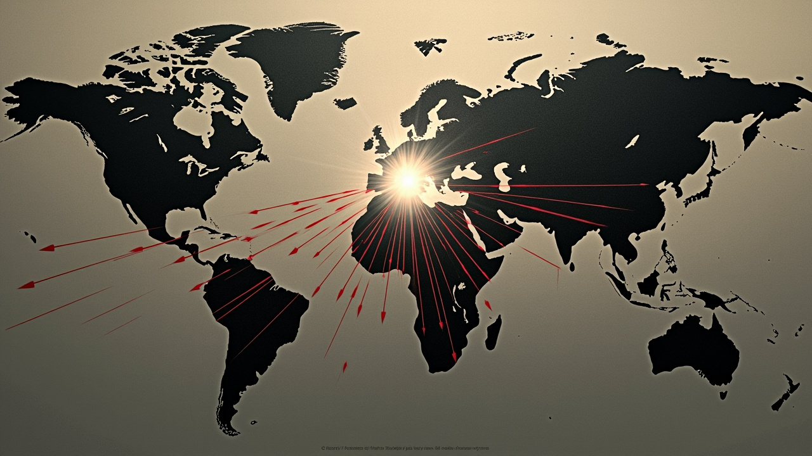

# 全球AI竞赛的地缘政治经济学——谁在剥削谁？

> 写作日期：2026-06-03（v2 压缩版：30 张 / 30 分钟 → 15 张 / 15 分钟）
> 配套文章：5/30《AI 会让人「异化」吗？》（个人异化层）
> 配套文章：6/3《Anthropic 2 个月反超 OpenAI》（巨头估值层）
> 本稿专注**全球结构**视角


---

## 【引入】~1 分钟 | 幻灯片 1

5 月 31 日，美东时间下午，美国商务部 BIS 在周末发了一份新指南：**凡总部设于中国或澳门的实体，即便身处中国境外，向其出口先进 AI 芯片均需许可证。**

之前中国公司把子公司开到马来西亚，从英伟达买芯片装在马来西亚的服务器上，再远程用——这条路被堵了。业内估算，过去一年**有数十万颗高端 AI 芯片经这条路流入中国 AI 公司。**

这件事背后是一个大问题——**AI 不是全球公共品。**

今天我用马克思政治经济学 + 依附理论，回答三个问题：

- **经济**：跨国 AI 资本怎么循环？利润往哪流？
- **科技**：算力、模型、数据的"国界"在哪里？
- **政治**：美 / 中 / 欧三套 AI 规则怎么博弈？

---

## 一、理论框架 | ~1 分钟 | 幻灯片 2

我用一个**三层类比**开始——

| 工业时代 | AI 时代 |
|---|---|
| 土地（不动产） | **算力**（GPU 集群） |
| 机器 | **基础模型** |
| 原材料 | **数据** |

这个类比不是文学修辞。马克思《政治经济学批判大纲》的"机器论片段"讲过：机器大工业的胜利是"不变资本对可变资本的胜利"。AI 时代也是——模型公司取代工人，capex 取代工资。

数据印证：英伟达加速卡单季收入 **$60.4B**，近三年涨 **1600%**。这不是技术进步能解释的。**这是 AI 时代"算力地租"的国家化。** NVIDIA 通过 GPU 专利 + CUDA 生态垄断，攫取的就是 AI 时代的"算力地租"。

再看**沃勒斯坦的世界体系**：

- **中心**：美国 + 中国——掌握模型 + 算力
- **半边缘**：欧盟 + 日韩 + 印度——掌握应用 + 制造
- **边缘**：拉美 + 非洲 + 东南亚——提供**数据 + 矿 + 廉价电力**

**谁在剥削谁？看两件事——利润流向（资金流）和规则制定权（规制权）。**

---

## 二、经济层 | ~4 分钟 | 幻灯片 3-5

### 3. AI 资本的金字塔

```
塔尖：模型公司（Anthropic / OpenAI / Google）
       估值 $852B - $965B
塔身：基础设施（AWS / Azure / xAI Colossus）
       2026 全球 capex $725B
塔基：硬件（NVIDIA / TSMC / 华为昇腾）
       NVIDIA 加速卡单季 $60.4B
底层：能源 + 矿
       NextEra 收 Dominion $67B（史上最大公用事业并购）
```

注意：这不是"AI 公司"的金字塔，是**整个 AI 产业**的金字塔。

传统互联网的价值集中在塔尖（应用层）。AI 不一样——**资本和利润高度集中在塔基和塔身**。算力 + 能源 + 矿，粗估比模型本身更值钱。

### 4. 一笔算力账：Anthropic 付 xAI $1.25B/月

最能说明问题的是一笔具体的账。

近期 SpaceX 递交 S-1 时披露：**Anthropic 每月付 xAI 12.5 亿美元，独占 Colossus 1。** Colossus 1 是 xAI 在孟菲斯建的超级计算集群——**220,000 颗 NVIDIA GPU，300 兆瓦电力**。

12.5 亿一个月，一年 150 亿美元。**这是什么概念？** 半年前 Anthropic 的年化收入才 90 亿。它现在愿意把收入的一半付给算力。

这件事说明三件事：

1. **算力从"商品"变成"必须签长约的资产"**——大模型公司宁可付天价也要独占算力
2. **Anthropic 自己的 capex 不够**——$47B ARR 听起来很多，但训练下一代模型需要指数级算力
3. **xAI 找到了一个"反特斯拉"模式**——不靠卖车，靠卖算力赚钱

### 5. 谁在给谁付钱？——资金流图

```
美国基金（Altimeter / Sequoia / Coatue / ICONIQ）
    ↓ 投资
Anthropic（估值 $965B）
    ↓ 付算力
xAI Colossus（$15B/年）
    ↓ 采购
NVIDIA（$60B 单季）+ TSMC + 田纳西电力公司
    ↓ 利润回流
美国基金 + 股东
```

**资金从算力中心流向算力中心。**

全球南方在这条链里的角色——

- 提供**钴 / 铜 / 锂**（矿）——刚果（金）、智利、澳大利亚
- 提供**数据**——拉美、东南亚用户的所有 prompt
- 提供**廉价电力**——中东（沙特、阿联酋）+ 北欧
- **最后买单**——用美元结算 API 调用费

**全球南方被四重定价。**

---

## 三、科技层 | ~4 分钟 | 幻灯片 6-8

### 6. 算力、模型、数据的"国界"

| 层级 | 谁掌握 | 流动自由吗 |
|---|---|---|
| **算力**（GPU） | NVIDIA（美）vs 华为昇腾（中） | ❌ 出口管制 |
| **基础模型** | Anthropic / OpenAI / Google（美）vs DeepSeek / Qwen / GLM（中） | ⚠️ API 限制 |
| **数据** | 各国家 + 平台 | ❌ 数据主权 |
| **应用层** | 全球开发者 | ✅ 自由流动 |

这张表可以解释 90% 的 AI 地缘新闻。应用层是自由流动的，底下三层（算力 / 模型 / 数据）全部有国界。**国界意味着定价权。**

### 7. 出口管制的演化

| 时间 | 政策 | 重点 |
|---|---|---|
| 2022/10 | 首次禁令 | A100 / H100 |
| 2023/10 | 性能阈值细化 | FLOPS / 带宽 |
| 2025/1 | AI Diffusion Rule | 全球分级 |
| 2025/5 | Trump 政府暂缓执行 | 留漏洞 |
| **2026/5/31** | **BIS 新指南** | **海外子公司也管** |

**从"限产品"到"限实体"再到"限国家"，管制粒度越来越细。** 5/31 新规堵的是过去一年的"漏洞"——中国公司把子公司开到马来西亚 / 越南 / 墨西哥，从英伟达买合规的高端芯片，再远程用。**只要母公司在中国或澳门，无论子公司在哪国，都要许可证。**

**这是"算力地租"的国家化。** 美国把算力从"商品"重新定义为"战略物资"。

### 8. 国产算力的突破时刻

但中国没有坐以待毙。**4/24/2026**——这一天值得记。


**DeepSeek V4 正式发布**（V4-Pro 1.6 万亿参数，490 亿激活），**同日华为宣布昇腾超节点全系列支持 V4。**

这是**国产大模型首次在国产芯片上完成从训练到推理的全栈部署**。

关键数据：

- V4-Pro 推理时延：**20ms** / V4-Flash：**10ms**
- 适配厂商：华为 + 寒武纪 + 摩尔线程 + 海光 + 百度昆仑芯——**全部"Day0" 适配**
- 客户反应：**字节、腾讯、阿里加码采购昇腾 950PR**

黄仁勋 4/15 接受帕特尔专访时说过一句话：

> "要是哪天像 DeepSeek 这样的成果先在华为平台上出现，那对我们国家会是非常糟糕的结果。"

——4/24，这句话应验了一半。**DeepSeek V4 跑在昇腾上，但首发模型还是 OpenAI / Anthropic 主导。**

DeepSeek 官网定价页有一行小字：**"受限于高端算力，目前 Pro 的服务吞吐十分有限，预计下半年昇腾 950 超节点批量上市后，Pro 的价格会大幅下调。"**

**中国最好的大模型公司，把旗舰产品的定价节奏绑定在了国产芯片的出货进度上。**——这是 AI 时代最关键的一句话。

**开源是 AI 时代的"反中心武器"**——2026 年 4 月开源权重榜，中国 GLM-5 排第一（85 分），DeepSeek / Qwen 紧随。

---

## 四、政治层 | ~2.5 分钟 | 幻灯片 9-10

### 9. 三套 AI 规则


| 维度 | 美国 | 中国 | 欧盟 |
|---|---|---|---|
| **主导逻辑** | 国家安全 | 产业自主 + 安全 | 基本权利 |
| **主要工具** | 出口管制 | 国产替代 + 数据安全法 | AI 法案（风险分级） |
| **2026 关键事件** | 5/31 新规堵漏 | DeepSeek V4 国产化 | 5/7 Omnibus 推迟 |
| **对 AI 公司态度** | 友好 + 定向管制 | 政策倾斜 + 国资支持 | 谨慎 + 高门槛 |
| **代表公司** | OpenAI / Anthropic | DeepSeek / 字节 / 阿里 | Mistral / Aleph Alpha |

三套规则，**底层逻辑完全不同**。

- **美国**："我能卖你不能买"——5/31 新规该管的管，不该管的继续做生意
- **欧盟**："先立法再延期"——AI 法案高风险合规从 8/2026 推到 12/2027，立法速度第一，执法跟不上
- **中国**："我有你也有"——华为 + 哈勃 + 国产模型公司三家协同，举国体制

### 10. 不可兼容性

三套规则不能兼容。冲突的关键点——

- **算力**：美国不让中国买，中国不让美国卖——**双输**
- **数据**：欧盟要跨境流动保护，中国要数据主权——**难调和**
- **模型**：美国要"价值观对齐"，中国要"发展优先"——**结构性对立**

**没有一套能套用到其他两方。** 这不是"规则竞争"，是**规制权的不可兼容性**。

马克思讲"上层建筑适应经济基础"。今天上层建筑（AI 规则）跑在经济基础（AI 资本）前面。**规则脱嵌于现实，结果是规则之间互相打架。** 我的判断：**未来 2-3 年，三套规则不会收敛，反而会越来越分裂。**

---

## 五、三个案例 | ~3 分钟 | 幻灯片 11-13

### 11. 案例 1：5/31 美国新规

5/31 新规的真正目的不在消灭中国 AI，**在保护本国 AI 公司的领先优势 12-18 个月**。

为什么是 12-18 个月？两个时间窗口：

1. **下一代模型发布周期**——Anthropic Mythos、OpenAI GPT-6、Google Gemini 4 都在 2026 H2 发布
2. **国产算力替代周期**——昇腾 950PR 量产是 2026 下半年，960/970 系列是 2027-2028

12-18 个月之后，中国国产算力起来了，出口管制的边际效果会下降。

**中国怎么应对**：自研 + 灰色市场 + 算法优化（DeepSeek 路线）+ 开源换市场（全球南方）。

**判断**：5/31 新规是"美国 AI 政策近期最有分量的一张牌"——再用几年，边际效果会显著下降。

### 12. 案例 2：DeepSeek V4 的"垂直整合"胜利

这是"国产替代"从"能造"到"能用"的关键拐点。**但本质是"垂直整合"的胜利。**

- 哈勃投资 112 个上游项目（连接器、电源、测试、光芯片）
- 华为 30 年硬件积累（昇腾 → 鲲鹏 → 海思）
- DeepSeek 算法突破（V4 是开源世界 SOTA）

**缺一不可。** 单一突破不够，**体系协同才有用**。

哈勃体系下的关键供应商（部分）：

- **华丰科技**（连接器）：2025 年营收 25.28 亿，**华为占 60.52%**
- **源杰科技**（光芯片）：2026 Q1 营收 3.55 亿，**+320.94%**

**这些公司 2025 年业绩集中爆发。** 但下游集成商还在亏——

- **神州数码**（整机）：2025 年 AI 业务 +47.7%，但利润率**刚过 1%**
- **川润股份**（液冷）：液冷产品 +77.76%，但全年**亏损 2491 万**

**判断**：昇腾替代英伟达的故事，下半场是"利润怎么分配"。哈勃体系内上游吃肉，整机 / 集成商喝汤——**这是中国"国产替代"的内部剥削结构**。

### 13. 案例 3：全球南方被四重定价



| 资源 | 提供方 | 定价方 |
|---|---|---|
| 钴、铜、锂 | 刚果、智利、澳大利亚 | 英伟达 / TSMC |
| 数据 | 全球用户（prompt） | OpenAI / Anthropic / 字节 |
| 廉价电力 | 沙特、北欧 | 数据中心运营商 |
| API 调用 | 美元结算 | 美元 / 美联储 |

**没有任何一家全球南方公司进入 AI 模型前 20。**

AI 时代的"原材料"（数据 + 矿 + 廉价电力）仍然被中心定价。上一轮工业化的剥削是"原料出口 + 制成品进口"。AI 时代的剥削是**"数据出口 + API 进口"**——原料换了，剥削结构没变。

**判断**：全球南方短期内不会有自己的"DeepSeek"——他们连买 1,000 颗 GPU 的资本都凑不齐。**算力的规模效应是赢家通吃，资本门槛从"百万美元"（建厂）变成"百亿美元"（建数据中心）。** 破局的唯一可能：**用开源**。

---

## 【结尾】| ~1.5 分钟 | 幻灯片 14-15

### 14. 谁在剥削谁？——我的判断

回到开头的题：**谁在剥削谁？**

**四层剥削**：

1. **直接剥削**：中心（美 / 中）对边缘（全球南方）的**算力 + 数据 + 利润**三重抽取
2. **间接剥削**：中心之间的"卡脖子"互相消耗（5/31 新规、Omnibus 推迟），**成本最终转嫁给全球南方**
3. **新型剥削**：模型本身在重塑劳动——5/30 稿讲的"异化"是这一剥削的**微观层**
4. **内部剥削**：中心内部也在剥削——哈勃体系下上游吃肉、下游喝汤，是"国产替代"的内部结构

**剥削的形式变了**：从殖民地的直接掠夺，变成"算力地租 + 数据地租 + 平台佣金"。

**未来 2-3 年**：

- **AI 帝国主义（短期主调）**：中心继续掌控算力 + 模型 + 数据，利润回流本国
- **AI 公共化（长期可能）**：中国方案（开源权重）+ 欧盟方案（AI 法案 + 跨境数据保护）——联合国方案？**目前没有，这是 AI 公共化的最大缺口**

**我的判断**：短期 AI 帝国主义是主调。长期看，**中国开源是最大的"反中心"力量**——但中国开源也带"中国价值观"，能不能成为"公共"，还要看 2027-2028 年的演化。

### 15. 三个开放问题

1. **如果 Mythos 这类"双用途模型"出现，AI 法案 + 出口管制都拦不住——规则会失效吗？**
2. **当国产芯片定价节奏绑定大模型价格，中国的"国产替代"会不会变成新的"中心-边缘"？**
3. **全球南方什么时候会有自己的"DeepSeek"？还是永远不会有？**

这三个问题，没有标准答案。**理解 AI 时代的剥削结构，是回答这三个问题的前提。**

谢谢。

---

## 附：本文待核实事项

- "民主国家算力是中国 11 倍"——Threads 转引，业内估算
- "过去一年数十万颗高端芯片经海外子公司流入"——路透社引供应链人士，无审计数据
- H200 出口许可——HKEPC 提及但条款未明
- 950PR 实际产能——业内数据
- 欧盟 AI 法案 Omnibus 终稿——5/7 是临时协议
- Anthropic 付 xAI $1.25B/月——SpaceX S-1 披露，Augment Market 引用

---

*理论框架：马克思政治经济学 + 沃勒斯坦依附理论。*
*写作时间 2026-06-03 v2 压缩版。*
