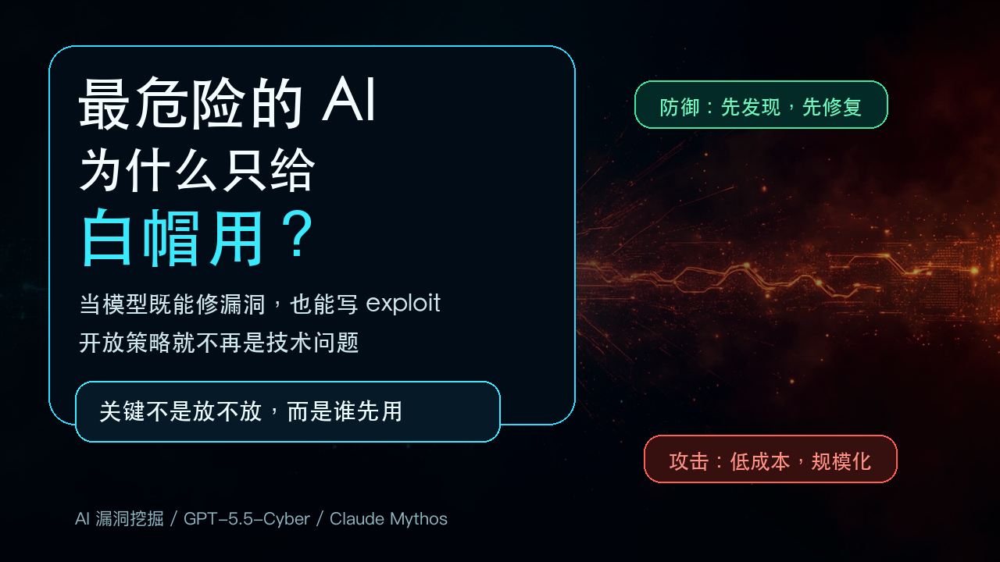
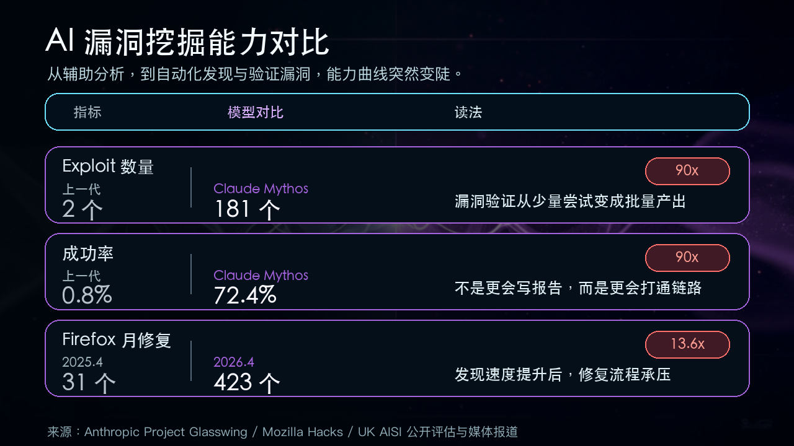

# 最危险的 AI，为什么只给白帽用？

Sam Altman 前脚刚嘲讽完 Anthropic，后脚就做了同样的事。

4 月初，Anthropic 发布 Claude Mythos。这个模型因为编码能力太强，"意外溢出"了漏洞挖掘能力。Anthropic 选择不公开。只把模型开放给约 50 家经过审核的机构，成立了 Project Glasswing 防御联盟。

Altman 在 Core Memory 播客上没客气。他说这种限制策略本质上是贩卖恐惧：

> "我们造了一颗炸弹，准备往你头上扔。然后告诉你，花一亿美元，我们卖你一个防空洞。"

话够狠。

几周后，5 月初，OpenAI 发布了 GPT-5.5-Cyber——一个网络安全专用模型。访问策略？只开放给"经过验证、致力于保护关键系统的可信防御者"。

一模一样。

这不是双标那么简单。真正的问题是：当 AI 既能发现漏洞、生成攻击代码，也能帮防御者抢修，你该怎么决定谁能先用？

这个问题的答案，正在重塑整个安全行业。

---

## AI 找漏洞，到底强到哪了

先搞清楚一件事：现在的 AI 在安全领域，已经不是"辅助工具"了。

过去是什么样？AI 帮你读代码、分类漏洞、写写安全报告。它不会发现你不知道的东西。

现在呢？

现在的 AI 能主动扫描代码库，找到人类审计漏掉的漏洞。能生成验证代码。能把多个小漏洞串成完整攻击链。不是理论上的"能做"——已经在做了。

Claude Mythos 在 Firefox 147 的 JavaScript 引擎上一口气跑了 181 个可用 exploit。上一代最强模型 Opus 4.6 的成绩是多少？2 个。成功率从 0.8% 跳到 72.4%。

它发现了一个在 OpenBSD 里藏了 27 年的 TCP 协议漏洞。还发现了一个 16 年前的 FFmpeg H.264 解码器漏洞。

最让人警觉的不是漏洞数量，是串联能力。Mythos 把 4 个浏览器漏洞串在一起，完成了沙箱逃逸。把多个 Linux 内核漏洞组合起来，实现了权限提升。

这不是"辅助发现漏洞"。这是把一个攻击链条从头到尾自动化。

英国 AI 安全研究所独立验证了一件事：Mythos 是第一个完成端到端 32 步企业网络攻击模拟的 AI。注意，是 32 步——不是单一操作。它在 73% 的专家级 CTF 挑战中拿到了解决方案。

GPT-5.5-Cyber 也不弱。同一个机构评定它为"网络安全任务上最强的模型之一"，是第二个完成端到端多步攻击模拟的系统。

一句话总结这个变化：**漏洞发现这件事，从手工匠人模式进入了工业流水线模式。**

原来找一个高危漏洞，要一个资深研究员花几周。现在 AI 花几个小时，几十美元的计算成本，批量产出。

---

## 为什么不直接公开

因为成本低到让攻击变得"可规模化"。

Mythos 跑一次 exploit 只需约 $50 的计算资源。花 2 万美元，可以对 OpenBSD 发起 1000 次并行扫描。

这意味着什么？以前搞漏洞挖掘，你得雇得起人。一个顶级安全研究员年薪几十万美元。你养不起几个人，你的攻击能力就有限。

现在呢？租点 GPU，写个脚本，让 AI 自己去扫。你不用是专家，不用懂二进制逆向，不用理解内核。AI 替你把活干了。

有人会说：那把模型开源，让所有人一起用，防御者不也受益？

问题是护栏可被移除。

Yoshua Bengio——图灵奖得主、"AI 三教父"之一——特别警告了这一点。他说开源模型可能比 Mythos 这类专有系统更危险。因为开源后安全护栏可以轻松剥离，强大的网络攻击能力会直接落到恶意行为者手里。

但还不止这些。

cURL 项目是开源世界最知名的网络库之一，几十亿设备在用。他们的安全团队用了 AI 分析工具，确实找到了 100 多个之前没发现的深层漏洞——人类审计、fuzzing、静态分析都漏掉的那种。

但同一个团队也被迫关闭了漏洞赏金计划。

为什么？因为提交上来的漏洞报告，95% 是 AI 生成的幻觉。这些报告看起来极其专业——伪造的 GDB 调试会话、完整的寄存器转储、看似合理的技术分析。但它们全是假的。

一个 7 个人的安全团队，本来就在超负荷运转。现在每天要花大量时间鉴别哪些漏洞是真的，哪些是 AI 编的。

即使是善意的使用，也可能把开源维护者淹没。

---

## 为什么"只给白帽"也有问题

但反过来，"只给经过审核的防御者"就完美吗？

Project Glasswing 的成员名单看上去很漂亮：AWS、苹果、思科、CrowdStrike、Google、摩根大通、微软、NVIDIA、Palo Alto Networks、Linux 基金会。还有 40 多家关键基础设施组织。

Anthropic 掏了 1 亿美元的使用积分，外加 400 万美元直接捐给开源安全。

问题是：谁来决定谁能上这个名单？

Bengio 说得直接："私人个体在替所有人决定基础设施的命运。"他追问：那些没拿到权限的公司和国家怎么办？

欧洲监管机构几乎全部被排除在外。欧盟委员会自己都不在那 40 个组织里。数十名欧洲议员联名致信欧盟委员会，称"一场与时间的赛跑已经开始，欧洲没有准备好"。英国央行公开向 Anthropic 施压要求访问权。IMF 和世界银行的春季会议被 Mythos 的讨论意外占据。

而美国国防部在 2026 年 2 月将 Anthropic 列为"供应链威胁"——这是该法律条款首次被用于一家美国公司。起因是 Anthropic 拒绝在自主武器和大规模国内监控两个场景中放开模型限制。Anthropic 正在法院挑战这个决定，加州法院已临时阻止禁令。

这已经不是技术问题。这是地缘政治。

更麻烦的是，封闭不等于安全。David Sacks（前白宫加密和 AI 主管）4 月底公开说过：包括中国模型在内的所有前沿模型，大约 6 个月内就会追上 Mythos 的网络安全能力。不公开可以让前沿能力暂时集中在一小群人手里，但拦不了多久。等能力溢出了，没有护栏的版本会比现在更难控制。

还有个更深层的信号来自 Firefox。

2026 年 4 月，Firefox 发布了 423 个漏洞修复。去年同月只有 31 个。增长了 13.6 倍。

Mozilla 杰出工程师 Brian Grinstead 说了一句话："这些东西突然变得非常好用了。"

注意，他不是在说某个专门的安全模型。他说的"这些东西"就是通用的前沿 AI 模型。编码能力强到一定地步，漏洞挖掘能力就自己溢出来了。

423 个修复一个月——这不是"AI 帮助安全团队"。这是在说：漏洞被发现的规模已经大到传统修复流程扛不住了。

而且 Firefox 并没有用 AI 来自动修漏洞。修复流程还是老样子：一个工程师写补丁，另一个审查。AI 生成的补丁代码通常没法直接用，只能当参考。

发现速度是工业级的。修复速度还是手工的。

---

## 攻防天平，到底往哪边倾

这个问题，目前没有人有答案。

乐观派有一个代表——Anthropic CEO Dario Amodei。他的逻辑很简单：一个软件里的漏洞总数是有限的。AI 帮防御者先把它们找出来修掉，攻击者就没东西可用了。"There are only so many bugs to find."

前白宫加密和 AI 主管 David Sacks 也站在这一边。他说 Mythos"不是魔法，不是末日装置。它是第一个能自动化网络任务的模型，后面还会有更多。"如果防御者始终先拿到，净效应会是正面的。

但实际干活的人没那么乐观。

Mozilla 的 Grinstead 说："这对攻击者和防御者都有用。但拥有工具会稍微向防御方倾斜一点。"然后他补了一句："说实话，目前没人知道答案。"

这句话很诚实。

没人知道答案，因为天平的两端都在被 AI 同时加速。过去，攻击者发现漏洞比防御者慢，所以"每月补丁日"是可行的。现在 exploit 开发从数周变成数小时，每月补一次就是每月给攻击者开一个窗口。

但防御者也不可能做到"发现即修复"。修复流程还是人在做，人的速度没有变快。

结果是什么？一个奇怪的中间状态：**找到的漏洞越来越多，修的速度跟不上，但能找到这些漏洞的 AI 又不让公开用。**

---

## 关键是"谁能先用"，不是"放不放"

今天这场争论很容易被简化成"开放 vs 封闭"。但真正的矛盾不在这里。

GPT-5.5-Cyber 和 Mythos 都在做同一件事。把漏洞挖掘这个曾经稀缺的能力，变成了一种可以分配的资源。谁能拿到它，谁就看到了别人看不到的软件裂缝。

目前的答案是：谁能通过审核，谁能加入联盟，谁有关系，谁先用。

这不理想。Yoshua Bengio 呼吁建立类似 FDA 的 AI 监管机构，让国家而不是企业来决定能力分配。能力落后的地区和国家应该有渠道获得防御能力。

但在国际协调到位之前，限制开放可能是最不坏的方案。

随便开放，攻击门槛崩盘，恶意行为者先拿到武器。完全封闭，少数机构垄断防御能力，被排除的人更危险。

谁先拿到 AI 漏洞挖掘工具，谁就先看到世界的软件裂缝。

还有一件事是确定的：Mythos 和 GPT-5.5-Cyber 不会是最后一个。David Sacks 说得对，这是"第一个"，后面还会有更多。模型能力在涨，开源在追。6 个月的时间差，很快就会变成 3 个月、2 个月。

到那个时候，开放策略就不是选择题了。是必答题。

---

*信息截至：2026 年 5 月 8 日*

*数据来源：OpenAI 官方公告、Anthropic 官方公告、UK AISI 独立评估报告、TechCrunch、The Register、Fortune、Cyber Defense Magazine、Mozilla 官方安全公告*
