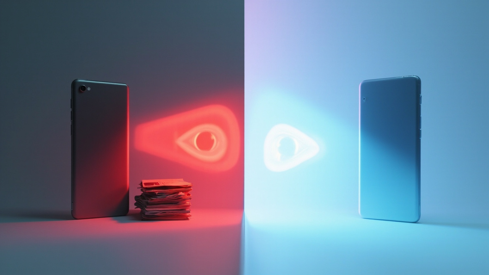
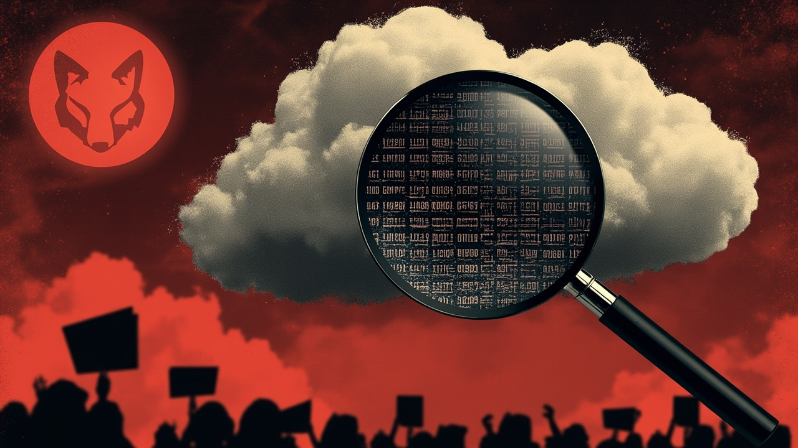
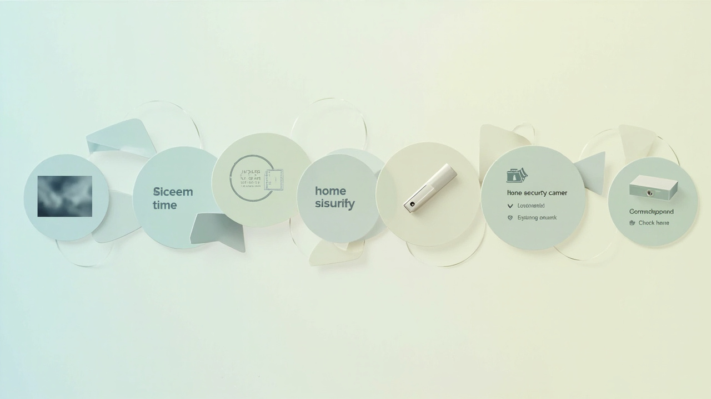
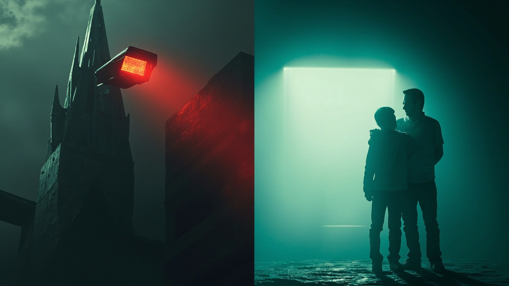
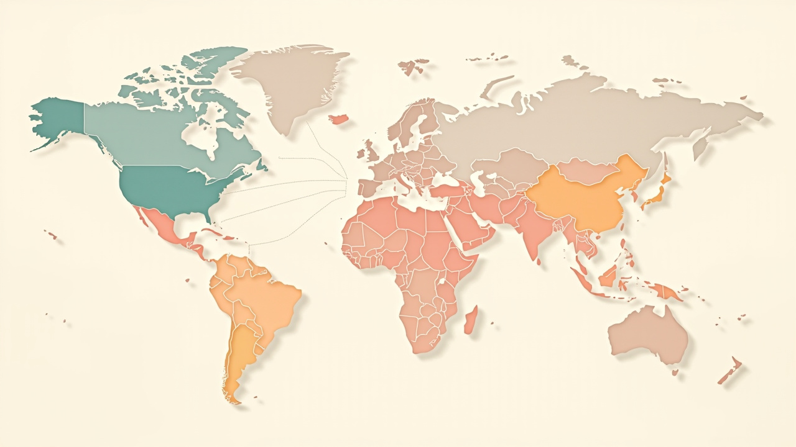

# 5 年前被骂到退场，5 年后苹果用"家长控制"再入场

> 写作日期：2026-06-09
> 工作流：standard
> 自审校：3 轮 self-review（详见 03-review-round-1.md）
> 配套配图：`images/苹果家长控制-WWDC26/`（5 张）

---

## 引入

6 月 8 日 WWDC26 keynote 当晚，Reddit 的 r/parentalcontrols 子版里出了一条帖子。

标题很直接：**"WWDC26 is a doomsday event for everyone surveilled with parental controls"**——对所有被家长控制监控的人来说，是个末日事件。

帖子里高赞评论几乎一边倒："苹果要替所有家长管孩子了"。

同一天，The Verge 发了另一篇完全相反的解读："Apple is redesigning Screen Time and overhauling child controls"——把 iOS 27 的家长控制升级描述为"深思熟虑的产品演进"。

**两篇文章描述的是同一件事。** 一个站未成年人 / 家长对立面，一个站苹果产品演进。

这篇文章我想说的是：苹果这次能"看起来"做对，并不是因为它换了什么新招。**路径没变——只是承者换了。**

5 年前苹果想做"帮 FBI 扫描 iCloud 照片找 CSAM"，被骂到退场。5 年后苹果做"在未成年人的 iPhone 上本地模糊暴力画面"，被当成产品升级欢迎。

**为什么？**

---

## 一、5 年前发生了什么

2021 年 8 月 5 日，苹果高调宣布三项儿童安全功能。

第一条：**iCloud Photos 客户端 NeuralHash 扫描**。苹果在设备端计算每张照片的"感知哈希"，与 NCMEC（美国失踪与受虐儿童中心）的 CSAM 数据库比对。命中后人工复核，账户被封则上报 NCMEC。

第二条：**iMessage Communications Safety**。未成年人收到或发送裸体图像时，**设备本地**模糊 + 警告。

第三条：**Siri / Search 干预**。用户问"如何隐藏 CSAM"这类问题时给干预提示。

现在回头看，前两条才是真问题。

EFF（电子前哨基金会）在 8 月 19 日发了公开声明 "Apple's Plan to 'Think Different' About Encryption Opens a Backdoor to Your Private Life"。**核心一句话**：客户端哈希扫描 = 一次为"儿童保护"打开的、政府可被复用的"先例后门"。

90+ 国际组织联署。密码学家 Matthew Green、Princeton 的 Jonathan Mayer 公开指出：**NeuralHash 哈希碰撞**可被恶意构造——攻击者能"栽赃"你账户里有一张 CSAM 图，你根本不知情。

Hacker News 上几天内就有人构造出两张**哈希一致**的不同猫狗图，作为 PoC。

2021 年 9 月 3 日，苹果宣布推迟 NeuralHash 上线，理由是"基于反馈进一步咨询"——事实上的暂停。

2022 年 12 月，苹果在"Expanded Protections for Children" 文档中**悄悄下线了 iCloud 端侧扫描**，保留了 Communication Safety（设备本地、不可被政府调用）和 Siri/Search 干预。

WIRED 当时的标题是："Apple Kills Its Plan to Scan Your Photos for CSAM. Here's What's Next"。

**5 年里苹果失去了什么？**

声誉上的"隐私立场"被削弱。CSAM 检测能力没真正建立起来。**但更重要的是——苹果的"儿童保护"叙事被搁置了。**

---

## 二、WWDC26 苹果更新了什么

5 年后 WWDC26 苹果**单独发了一份 child safety features 新闻稿**，没把它塞进 iOS 27 主线——这本身是个产品 + 法务信号。

具体 5 条线。

**1. Communication Safety 升级到暴力画面**

之前 Communication Safety 只针对裸露 / 性内容。WWDC26 这一版扩到**暴力画面**——苹果和美国儿科学会（AAP）合作制定年龄分级指引。

≤17 岁用户收到 / 发送含暴力画面的图片时，**设备本地自动模糊**，并显示"这张图含有暴力内容"提示。**不能关闭。**

**2. 自动 blur 扩展到 FaceTime 共享相册**

iOS 26 时 Communication Safety 只覆盖 iMessage。WWDC26 把范围扩到 **FaceTime 通话中共享的相册**。同样是 on-device，同样不破坏 E2EE。

**3. Screen Time / 家长控制重做**

新加 "App 时间配额（Recommended time allowances）" 和 "Ask to Browse（请求浏览特定网站）"。

家长可以设"社交 App 每天 1 小时"——孩子突破后必须请求。Safari 访问未列入白名单的网站时，会弹"Ask to Browse"提示，由家长审批。

**4. Home App 4K + AI 视频摘要**

Apple Intelligence 进入 Home App。摄像头支持 4K HDR，**并能在本地生成"今日门前发生了什么"的活动摘要**。

The Verge 和 CNET 都强调"AI 看摄像头"的隐私张力。这是 on-device AI 第一次进入家庭安防场景。

**5. Declared Age Range API**

苹果**不采生物特征**。给开发者一个 API：可以请求一个"用户是否 ≥13/≥16/≥18"的布尔判定，**依据是账户自报年龄 + 设备 / IP 区域推断 + App Store 分级匹配**。

苹果的"年龄保证"路线避开了 Google / Instagram 的人脸估年龄方案。

> **小结**：这 5 条线里第 1、2、4 条都在**设备本地做内容检测**——和 5 年前 NeuralHash 的能力有交集。但部署方式从"云端哈希"换成了"本地 ML 分类器"。

> **注**：第 4 条（Home 4K + AI 摘要）的具体技术细节是 on-device 还是 Private Cloud Compute——我没找到一手细节，**刻意不展开**，等 WWDC26 Session 视频（通常 6/8 当晚 / 6/9 发布）。

---

## 三、路径没变——承者换了

这是这篇文章最关键的一段。

5 年前苹果想做：

> 客户端哈希扫描 iCloud 照片 → 命中 NCMEC 数据库 → 人工复核 → 封号 + 上报 FBI

5 年后苹果做：

> 设备本地 ML 模型检测未成年人收到的暴力画面 → 模糊 + 警告 → 不可关闭

**核心 ML 能力几乎一样——都是设备端图像内容识别。**

差别在哪？

| 维度 | 2021 NeuralHash | 2026 Communication Safety |
|---|---|---|
| 检测对象 | 所有人（云端） | 未成年人（设备本地） |
| 调用方 | 政府（NCMEC/FBI） | 家长（设置默认开） |
| 隐私代价承担者 | 全体 iCloud 用户 | 17 岁以下未成年人 |
| 关闭选项 | 不可关 | 17 岁以下不可关 |
| 政府能否复用 | 理论上能 | 不能（on-device + 无日志） |

**路径没变。承者换了。**

2021 年是"全社会的隐私代价"——所有 iCloud 用户的照片都被机器扫一遍。

2026 年是"未成年人 + 家长的隐私代价"——只有 17 岁以下的孩子收到 / 发送的图像被模糊，且只能由家长决定怎么解读。

5 年前 Open the backdoor 的人是苹果自己。5 年后替苹果"做家长"的还是苹果——但这次被叫好。

> **注**：EFF 2026 年初是否有对 client-side scanning 扩展的新声明——我没找到 2026 年具体声明，**刻意不展开**。EFF 的核心立场（2021 年那份）依然有效，不需要 2026 年新声明来支撑本文论点。

---

## 四、苹果为什么这次看起来能成

三个原因。

**第一，5 个司法辖区 5 套压力下的"中位标准"。**

| 辖区 | 监管压力 | 性质 |
|---|---|---|
| 美国 Texas | SB 2420 App Store 年龄验证 | **被迫**（已落地） |
| 英国 | Starmer 4 月公开点名 Apple/Google | **被迫** |
| 欧盟 | DSA + 16 岁社媒禁令提案 | **半主动** |
| 中国 | 防沉迷 + 实名（2018 起） | **早已完成** |
| 全球无强制地区 | 拉美 / 东南亚 / 印度 | **主动设中位标准** |

- 美国 Texas SB 2420（2025）要求 App Store 对所有用户做年龄验证——苹果在 Texas App Store 已经实施"新账户必须自报年龄 + 13 岁以下需家长设置儿童账户"。
- 英国首相 Keir Starmer 2026 年 4 月公开给 Apple / Google 三个月期限，要求"激活内置的儿童裸体拦截"——直接对应 iOS 27 这次 Communication Safety 升级。
- 欧盟 DSA 要求大型平台对未成年人提供"高隐私高安全"标准；von der Leyen 2025 年提出"social media delay"——直接要求成员国禁止 16 岁以下使用社交媒体。
- 中国《未成年人保护法》+ 防沉迷——苹果 App Store 中国区 2018 起就已经实名认证，2024/2025 多次按网信办要求下架 App。
- 全球没有强制的地区（拉美 / 东南亚 / 印度）——苹果**主动**也默认开。

**这 5 套压力让苹果的"中位标准"必然倾向"默认开"——因为"默认关"会在至少 3 个辖区违规。**

**第二，不采生物数据——避开了 Google/Instagram 的路。**

Google、Instagram、Yoti 等都在做"人脸估年龄"——用摄像头 + ML 推断用户是否成年。

苹果的 Declared Age Range API **不采生物特征**。只查账户自报年龄 + 设备 / IP 区域 + App Store 分级匹配。

这是关键的"中位选择"——既满足监管的"年龄验证"要求，又不让步"生物数据"这条底线。

**第三，补了 2021 缺失的"专家共识合法性"。**

2021 年苹果只说"我们要扫 iCloud"——被 90+ 国际组织联署反对。

WWDC26 苹果发了**和 AAP（美国儿科学会）合作的数字健康指引**。

这把"儿童保护"从"苹果的合规动作"重新包装为"医学共识的工程实现"。

**这三个加起来，让苹果这次看起来能成。** 但真正的代价是——未成年人 17 岁以前失去了一项"不被机器扫描"的数字权利。

> **注**：中国网信办对 iOS 27 是否会发新版合规要求——通常 9-10 月发布，**这次默认开是否会被要求"更严"，要等秋天才能看到**。

---

## 结尾

写到这里，我有几个问题答不上来。

1. **5 年后能不能避免 5 年前的错误？** NeuralHash 的"哈希碰撞" PoC 是技术问题——on-device 模糊的 ML 模型**也会有类似漏洞**吗？我没找到任何公开分析。如果有人构造出一张"任何 ML 模型都判定为暴力"的图，被系统误判，谁来负责？

2. **家长默认开 + 不可关闭的边界在哪？** 现在是"≤17 岁暴力画面默认模糊"。明年是不是会扩到"≤17 岁所有 NSFW 内容"？后年是不是会扩到"≤17 岁政治敏感"？苹果说"现在只针对暴力和裸露"——但**技术能力一旦部署，监管压力会推着它扩张**。

3. **真正主动设标准的代价是什么？** 苹果在拉美 / 东南亚 / 印度这些**没强制**的地区也默认开。这听起来是好事——但这些地区的家长未必知道 Communication Safety 是什么、孩子在 18 岁以后**自己关不掉**这件事是否合理。苹果在帮这些地区"提前合规"，但本地监管和本地文化讨论没跟上。

**这三个问题，没有标准答案。**

但有一件事是清楚的：5 年前苹果用"为儿童保护"打开过一次后门，被骂回去了。5 年后苹果用同样的技术能力、不同的"承者"再入场。**这次看起来能成，不代表下次也能成。**

理解 5 年前发生了什么，是判断 5 年后会怎么演化的前提。

---

*写作时间 2026-06-09。配套配图 5 张：封面（5 年前后对比）+ 4 张节插图（5 年前事件 / WWDC26 5 条更新 / 2021 vs 2026 表格 / 5 国监管地图）。*